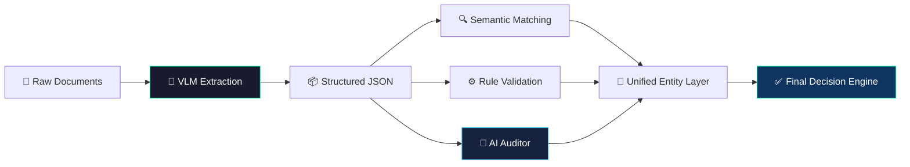
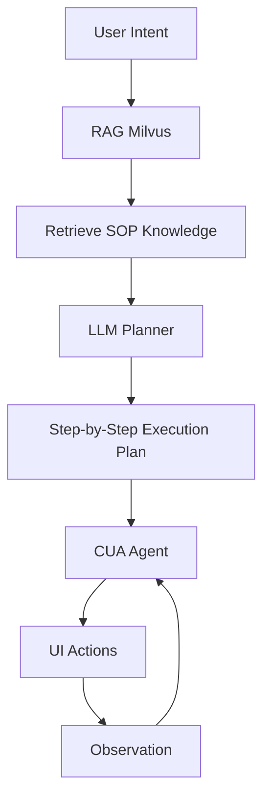

<!-- ======================= HEADER ======================= -->
<div align="center">
  

  <h2>Hi, I'm Ahmad 👋</h2>

  

  <br/><br/>

  <p>
    <a href="https://www.linkedin.com/in/ahmad-mle/">
      
    </a>
    <a href="https://pypi-ahmad.github.io/">
      
    </a>
    <a href="https://t.me/dataintuitionist">
      
    </a>
  </p>
</div>

<br/>

<!-- ======================= CORE MESSAGE ======================= -->
## 🚀 What I Do

I build **reliable, production-grade AI systems** — not demos.

```diff
- LLM ≠ Product
+ System = LLM + Tools + Memory + Verification + Observability
```

* System-2 AI (plan → reason → verify → execute)
* Agentic workflows with tools + memory
* Reliability: validation, evals, observability
* From **unstructured data → production systems**


<!-- ======================= SYSTEMS ======================= -->

## 🔥 Production-Grade AI Systems

<p align="center"><i>Systems designed for reliability, evaluation, and real-world deployment — not demos.</i></p>

---

### 📄 Intelligent Document Processing (Enterprise IDP)

```text
OCR → LLM Extraction → Structured JSON → Validation → Final Output
```

* PaddleOCR with layout grounding (bounding boxes)
* LLM reasoning across fragmented policy clauses
* Schema-aligned structured outputs
* Canonical document validation layer

**Insight:** Never trust raw LLM output → always validate

**Impact:** ~90% → ~99% accuracy, production-ready pipeline

👉 **[Read Case Study Below](#-case-study-1--intelligent-document-processing-idp-ai)**

---

### 🤖 Computer-Using Agent (CUA + RAG)

```text
User → RAG (SOPs) → Structured Plan → CUA → UI Execution
```

* Milvus-based RAG over internal documentation
* LLM converts prompts → executable workflows
* AWS deployment + Dockerized runtime

**Insight:** Agents fail due to poor instructions, not models

**Impact:** ~38% → ~80% success rate

👉 **[Read Case Study Below](#-case-study-2--computer-using-agent-cua)**

---

### 🧠 Autonomous Research Agent (System-2 AI)

```text
Planner → Parallel Retrieval → Synthesizer → Critic → Refiner
```

* Multi-agent LangGraph system
* Parallel tool-based retrieval
* Critic-driven evaluation loop

**Insight:** Reliability comes from evaluation loops

**Impact:** grounded, high-quality research outputs

---

### 🧠 Self-Healing Text-to-SQL Agent

```text
Schema → Generate → Validate → Execute → Retry
```

* Schema-aware SQL generation
* Guardrails for safe execution
* Error-aware retry loop

**Insight:** AI must be closed-loop systems

**Impact:** safe and reliable NL → SQL

---

### 📊 Data Systems (Databricks)

```text
Ingestion → Standardization → Joins → Unified Dataset
```

* Pandas + PySpark hybrid pipelines
* Schema normalization and joins

**Insight:** Data reliability > model performance

**Impact:** analytics-ready, consistent datasets

---


<!-- ======================= STACK ======================= -->

<h2 align="center">🛠️ Technical Arsenal</h2>

<p align="center">
  <b>GenAI:</b> LangGraph, LangChain, OpenAI, Gemini, Ollama<br/>
  <b>Data:</b> Databricks, PySpark, Pandas, Milvus<br/>
  <b>Backend:</b> FastAPI, Docker, AWS<br/>
  <b>ML/CV:</b> PyTorch, OpenCV, PaddleOCR
</p>

<table align="center" width="100%">
  <tr>
    <td align="center" width="20%"><b>🤖 Generative AI</b></td>
    <td align="center" width="20%"><b>🧠 Machine Learning</b></td>
    <td align="center" width="20%"><b>🌩️ Cloud & DevOps</b></td>
    <td align="center" width="20%"><b>📊 Data Engineering</b></td>
    <td align="center" width="20%"><b>💻 Core & Web</b></td>
  </tr>
  <tr>
    <td align="center" valign="top">
      
      <br/>
      <br/>
      <br/>
      <br/>
      
    </td>
    <td align="center" valign="top">
      <br/>
      <br/>
      <br/>
      <br/>
      
    </td>
    <td align="center" valign="top">
      <br/>
      <br/>
      <br/>
      <br/>
      
    </td>
    <td align="center" valign="top">
      <br/>
      <br/>
      <br/>
      <br/>
      <br/>
      
    </td>
    <td align="center" valign="top">
      <br/>
      <br/>
      <br/>
      <br/>
      
    </td>
  </tr>
</table>


<!-- ======================= STATS ======================= -->
<h2 align="center">⚡ Activity</h2>

<div align="center">
  
</div>

<div align="center">
  
</div>

<div align="center">
  
</div>


<!-- ======================= PHILOSOPHY ======================= -->
<h2 align="center">🧠 Engineering Philosophy</h2>
<div align="center">
  
</div>

<p align="center">
  I treat LLMs as <b>unreliable components</b> and build systems that enforce  
  <b>verification, observability, and deterministic behavior</b>.
</p>


<!-- ======================= SNAKE ======================= -->
<div align="center">
  
</div>


<!-- ======================= CASE STUDIES ======================= -->
# 📚 Deep Dive Case Studies

## 🧠 CASE STUDY 1 — Intelligent Document Processing (IDP AI)

### 📌 Problem
Traditional invoice/document pipelines rely on:
- **OCR + regex** → brittle and error-prone
- **Template-based extraction** → fails on real-world variation

**Goal:** Build a system that can handle noisy, unstructured, real-world financial documents with high accuracy + fraud awareness.

### 🏗️ System Architecture



### ⚙️ Key Components

#### 1. Generative OCR (VLM-based)
- **Replaces:** OCR → parsing → mapping
- **With:** Single-pass structured extraction
- **Why it matters:** Removes 3 failure points & handles layout variance naturally.

#### 2. Semantic Entity Resolution
- **Vendor names:** Fuzzy + vector matching
- **Design choice:** Avoid strict string matching (too fragile) → use semantic similarity.

#### 3. Hybrid Validation Layer
| Type | Role |
| :--- | :--- |
| **Deterministic** | Required fields, thresholds |
| **Probabilistic (LLM)** | Fraud signals, anomalies |

> **Key Idea:** Combine rules (precision) + LLM (reasoning).

#### 4. AI Auditor (Forensic Layer)
- Detects suspicious vendor emails, inconsistent tax logic, and unusual patterns.
- **Result:** Beyond extraction → decision intelligence.

### 🚀 Key Innovations
- Single-pass VLM extraction (no OCR pipeline fragmentation)
- Hybrid guardrails (rules + reasoning)
- Semantic normalization instead of string matching

### ⚖️ Tradeoffs
| Decision | Tradeoff |
| :--- | :--- |
| **VLM over OCR** | Higher cost per request |
| **LLM auditing** | Non-deterministic outputs |
| **Fuzzy matching** | Potential false positives |

### 📊 Impact
- **~99% structured extraction accuracy**
- Near zero manual intervention
- Detects fraud patterns missed by rule-based systems

> **Takeaway:** This system transforms IDP from “data extraction” → decision intelligence pipeline.

---

## 🤖 CASE STUDY 2 — Computer-Using Agent (CUA)

### 📌 Problem
Most automation systems:
- Break on UI changes
- Require hardcoded selectors
- Cannot reason about tasks

**Goal:** Build an agent that can understand UI state, execute tasks dynamically, and adapt like a human operator.

### 🏗️ System Architecture



### ⚙️ Key Components

#### 1. MCP Tool Layer
- Abstracts UI actions: `click`, `type`, `navigate`.
- **Note:** LLM doesn’t control browser directly; it uses structured tools.

#### 2. SOP Injection (Milvus)
- **Stores:** Prior workflows & execution patterns.
- **Why it matters:** Adds memory + consistency, reduces exploration cost.

#### 3. Vision-Guided Interaction
- Uses UI context instead of brittle selectors.
- **Moves from:** “click #btn-123” → **To:** “click submit button near form”.

#### 4. Feedback Loop
`Action → Observe → Evaluate → Retry`
- Enables adaptive execution & handles partial failures.

### 🚀 Key Innovations
- Tool-based abstraction (MCP)
- UI reasoning instead of hardcoded automation
- Memory-driven execution (SOP retrieval)

### ⚖️ Tradeoffs
| Decision | Tradeoff |
| :--- | :--- |
| **LLM control loop** | Latency |
| **Vision grounding** | Higher compute |
| **SOP memory** | Maintenance overhead |

### 📊 Impact
- **~80% reliability** in semi-structured UIs
- Automates workflows previously requiring humans
- Foundation for enterprise agent automation

> **Takeaway:** This system moves automation from scripts → intelligent agents.

---

## 🏥 CASE STUDY 3 — Clinical Decision Support System (MediScan)

### 📌 Problem
Healthcare systems struggle with:
- Manual data entry from PDFs/faxes
- Fragmented patient records
- High risk of prescription or claim errors

**Goal:** Build a privacy-first AI system that processes medical documents locally, extracts structured data, and assists in clinical + insurance decisions.

### 🏗️ System Architecture


### ⚙️ Key Components

#### 1. Local-First OCR (Privacy Layer)
- Runs fully offline using **Ollama** / **DeepSeek**.
- **Result:** No PHI leaves system (Critical for HIPAA compliance).

#### 2. Longitudinal Patient Analysis
- Cross-references medications, diagnoses, and history.
- **Result:** Enables context-aware decisions.

#### 3. BYOK LLM Adapter
- Local model → fallback to cloud.
- **Why it matters:** Balances privacy, performance, and cost.

#### 4. Insurance + Clinical Logic Engine
- Validates prescriptions, eligibility, and risk signals.

### 🚀 Key Innovations
- **Air-gapped AI pipeline** (rare)
- Hybrid local + cloud inference strategy
- Combines medical + insurance reasoning

### ⚖️ Tradeoffs
| Decision | Tradeoff |
| :--- | :--- |
| **Local models** | Lower accuracy vs cloud |
| **SQLite** | Limited scalability |
| **Rule-based checks** | Maintenance overhead |

### 📊 Impact
- Eliminates manual medical data entry
- Reduces prescription + claim errors
- Enables privacy-compliant AI deployment

> **Takeaway:** This system shows how AI can be deployed in regulated environments without compromising privacy.

<br/>

<!-- ======================= FOOTER ======================= -->
<div align="center">
  
</div>
