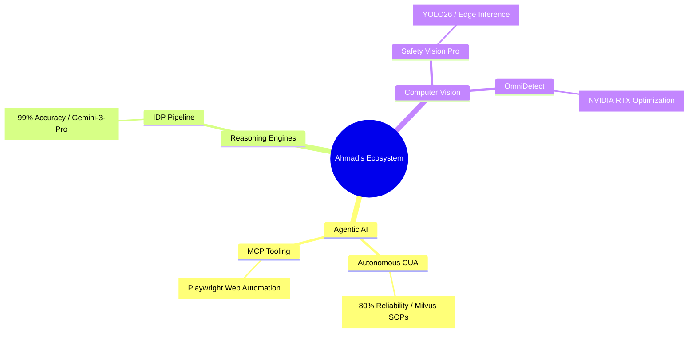

<!-- HEADER WITH TYPEWRITER ANIMATION -->

  

  <!-- TYPING SVG -->
  

   

  <!-- SOCIAL BADGES WITH GLOW EFFECT -->
  

    
    
    
  

 

<!-- HERO SECTION GRID -->
<table align="center" width="100%" style="border: none;">
  <tr>
    <td width="55%" valign="top">
      <h2>🚀 Mission Critical</h2>
      

        I specialize in the <b>"Last Mile"</b> of AI engineering—moving LLMs from experimental demos to reliable, enterprise-grade production systems.
      

      

        Currently architecting <b>System 2 AI</b>: loops where agents plan, reflect, and verify their own work before taking action.
      

      
    </td>
    <td width="45%" valign="top">
      <h3 align="center">⚡ Recent Activity</h3>
      

        <!-- 3D CONTRIB GRAPH (Requires Action Setup) -->
        
      

       
      

         
      

    </td>
  </tr>
</table>

 

<!-- CURRENT PROJECTS - TERMINAL STYLE -->
<h2>🔭 Active Deployments</h2>

 

<!-- TECH STACK - EXPANDED -->
<h2 align="center">🛠️ Technical Arsenal</h2>

<table align="center" width="100%">
  <tr>
    <td align="center" width="20%"><b>🤖 Generative AI</b></td>
    <td align="center" width="20%"><b>🧠 Machine Learning</b></td>
    <td align="center" width="20%"><b>🌩️ Cloud & DevOps</b></td>
    <td align="center" width="20%"><b>📊 Data Engineering</b></td>
    <td align="center" width="20%"><b>💻 Core & Web</b></td>
  </tr>
  <tr>
    <!-- GEN AI -->
    <td align="center" valign="top">
      
      
       
       
       
       
      
    </td>

    <!-- ML & CV -->
    <td align="center" valign="top">
      
       
      
       
       
       
      
    </td>

    <!-- CLOUD & DEVOPS -->
    <td align="center" valign="top">
      
       
      
       
       
       
      
    </td>

    <!-- DATA ENG -->
    <td align="center" valign="top">
      
       
       
       
       
       
      
    </td>

    <!-- CORE & WEB -->
    <td align="center" valign="top">
      
       
      
       
       
       
      
    </td>
  </tr>
</table>

 

<!-- SNAKE ANIMATION SECTION -->

  

 

<!-- FOOTER -->

  

