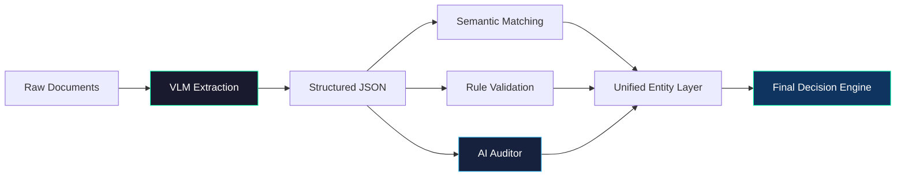
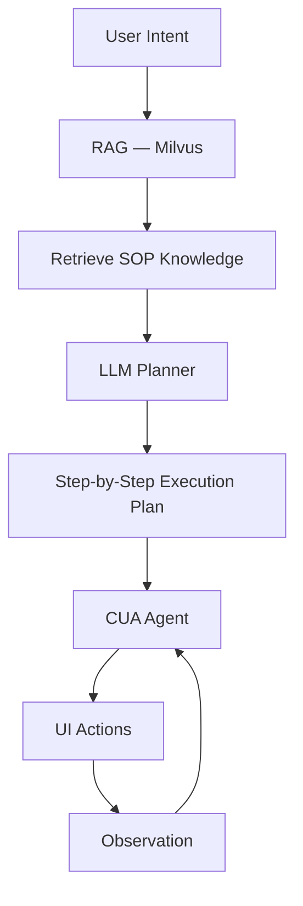
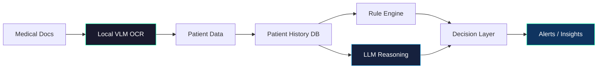

<!-- ======================= HEADER ======================= -->

  

  

    

  

    
    
    
  

 

<!-- ======================= ABOUT ======================= -->
## About

GenAI Engineer at **Deloitte** (July 2025 — present), building document intelligence pipelines, agentic automation systems, and healthcare AI on Azure. Previously **Associate Data Scientist at Cognizant** (Sep 2022 — May 2025), working on warranty analytics, conversational AI, and data pipelines.

**M.Tech** in Data Analytics & Decision Sciences — IIIT Kurnool · **B.Tech** in Computer Science Engineering — MANUU

I treat LLM outputs as unverified signals. Every system I build wraps model calls in structured validation, evaluation loops, and deterministic guardrails.

<!-- ======================= NOTABLE SYSTEMS ======================= -->
## Notable Systems

### Intelligent Document Processing

OCR + LLM extraction pipeline for scanned insurance documents. Layout-aware parsing, schema-aligned structured outputs, and multi-stage validation against canonical documents.

**Stack:** Python, PaddleOCR, GPT-5.1, Gemini, Pydantic · **Result:** ~90% → ~99% extraction accuracy

---

### Computer-Using Agent

RAG-grounded agent for UI automation. Retrieves SOPs from Milvus, generates structured execution plans, and acts through an MCP-based tool layer with Playwright and AX Tree parsing.

**Stack:** Python, OpenAI CUA, Milvus, MCP, Playwright, AWS, Docker, FastAPI · **Result:** ~38% → ~80% task success rate · ~40% token reduction via AX Tree optimization

---

### Clinical Decision Support System

Privacy-first medical document processing. Local-first execution with Ollama as the default model path, structured extraction of clinical and insurance data, and hybrid rule + LLM reasoning with optional cloud model adapters when permitted.

**Stack:** Python, FastAPI, Streamlit, SQLite, Ollama, Pydantic

---

### Autonomous Research Agent

Multi-agent LangGraph system with parallel tool-based retrieval, a critic-driven evaluation loop, and quality-scored synthesis.

**Stack:** Python, LangGraph, LangChain, Gemini, FastAPI, Streamlit, FAISS

---

### Healthcare Document Intelligence *(current)*

Medical fax parsing on Azure. Layout-aware extraction from noisy scanned documents, integrated with downstream insurance workflows.

**Stack:** Azure Document Intelligence, Azure Databricks, Python

<!-- ======================= OPEN SOURCE ======================= -->
## Open Source

### [GenAI Systems Lab](https://github.com/pypi-ahmad/genai-systems-lab)

Shared execution platform for 20 AI systems — 10 generative AI pipelines, 5 LangGraph state machines, 5 CrewAI multi-agent teams — unified behind a single API, frontend, and runtime.

- **Backend:** Python 3.13, FastAPI, JWT auth, input validation, rate limiting, SSE streaming
- **LLM dispatch:** Gemini, OpenAI, Anthropic, Ollama — BYOK per request
- **Frontend:** Next.js 16, React 19, TypeScript, Tailwind CSS v4
- **Runtime:** per-run confidence scoring, session memory, benchmark evaluation (15 projects), explainability
- **Contract:** all 20 projects implement `run(input, api_key) → dict` and inherit the full platform stack

---

### [Portfolio](https://github.com/pypi-ahmad/pypi-ahmad.github.io)

React SPA presenting work history, 8 system case studies, and a 20-system platform catalog. 147 automated tests covering rendering, behavior, navigation, accessibility, and contrast compliance. 32 theme families with WCAG 4.5:1 contrast enforcement.

**Live:** [pypi-ahmad.github.io](https://pypi-ahmad.github.io) · **Stack:** React 18, Vite, styled-components, Framer Motion

<!-- ======================= STACK ======================= -->

<h2 align="center">Tech Stack</h2>

<table align="center" width="100%">
  <tr>
    <td align="center" width="20%"><b>GenAI / LLM</b></td>
    <td align="center" width="20%"><b>ML / CV</b></td>
    <td align="center" width="20%"><b>Cloud & DevOps</b></td>
    <td align="center" width="20%"><b>Data</b></td>
    <td align="center" width="20%"><b>Backend & Web</b></td>
  </tr>
  <tr>
    <td align="center" valign="top">
       
       
       
       
       
       
      
    </td>
    <td align="center" valign="top">
       
       
       
      
    </td>
    <td align="center" valign="top">
       
       
      
    </td>
    <td align="center" valign="top">
       
       
       
       
       
       
      
    </td>
    <td align="center" valign="top">
       
       
       
       
       
      
    </td>
  </tr>
</table>

<!-- ======================= STATS ======================= -->
<h2 align="center">Activity</h2>

  
  

  

  

<!-- ======================= DEEP DIVES ======================= -->
## System Design Deep Dives

<b>Intelligent Document Processing (IDP)</b>

 

**Problem:** Traditional OCR + regex pipelines are brittle and fail on real-world document variation. Template-based extraction does not generalize across layout differences.

**Architecture:**

```mermaid
flowchart LR
    A[Raw Documents] --> B[VLM Extraction]
    B --> C[Structured JSON]

    C --> D1[Semantic Matching]
    C --> D2[Rule Validation]
    C --> D3[AI Auditor]

    D1 --> E[Unified Entity Layer]
    D2 --> E
    D3 --> E

    E --> F[Final Decision Engine]

    style B fill:#1a1a2e,stroke:#00FFAA,color:#fff
    style D3 fill:#16213e,stroke:#36BCF7,color:#fff
    style F fill:#0f3460,stroke:#00FFAA,color:#fff
```

**Key components:**
- **VLM-based extraction** — single-pass structured extraction replacing the OCR → parsing → mapping chain, handling layout variance naturally
- **Semantic entity resolution** — fuzzy + vector matching for vendor names instead of brittle string matching
- **Hybrid validation** — deterministic rules (required fields, thresholds) combined with LLM-based reasoning (fraud signals, anomalies)
- **AI auditor** — detects suspicious patterns (vendor emails, inconsistent tax logic) beyond basic extraction

**Result:** ~99% structured extraction accuracy

<b>Computer-Using Agent (CUA)</b>

 

**Problem:** Most UI automation relies on hardcoded selectors that break on UI changes and cannot reason about tasks.

**Architecture:**

```mermaid
graph TD;
    A[User Intent] --> B[RAG — Milvus];
    B --> C[Retrieve SOP Knowledge];
    C --> D[LLM Planner];
    D --> E[Step-by-Step Execution Plan];
    E --> F[CUA Agent];
    F --> G[UI Actions];
    G --> H[Observation];
    H --> F;
```

**Key components:**
- **MCP tool layer** — abstracts UI actions (click, type, navigate); LLM uses structured tools, not direct browser control
- **SOP injection via Milvus** — stores prior workflows and execution patterns, adding memory and consistency
- **AX Tree parsing** — reasons about UI structure instead of CSS selectors, ~40% token reduction over DOM-based approaches
- **Feedback loop** — action → observe → evaluate → retry for adaptive execution

**Result:** ~38% → ~80% task success rate

<b>Clinical Decision Support System</b>

 

**Problem:** Healthcare systems rely on manual data entry from PDFs and faxes, with fragmented patient records and high error risk.

**Architecture:**

```mermaid
flowchart LR
    A[Medical Docs] --> B[Local VLM OCR]

    B --> C[Patient Data]
    C --> D[Patient History DB]

    D --> E1[Rule Engine]
    D --> E2[LLM Reasoning]

    E1 --> F[Decision Layer]
    E2 --> F

    F --> G[Alerts / Insights]

    style B fill:#1a1a2e,stroke:#00FFAA,color:#fff
    style E2 fill:#16213e,stroke:#36BCF7,color:#fff
    style G fill:#0f3460,stroke:#00FFAA,color:#fff
```

**Key components:**
- **Local-first execution** — Ollama is the default path for privacy-sensitive workflows
- **Hybrid inference** — optional cloud fallback is supported when permitted
- **Clinical + insurance logic** — validates prescriptions, eligibility, and risk signals

**Stack:** Python, FastAPI, Streamlit, SQLite, Ollama, Pydantic

 

<!-- ======================= FOOTER ======================= -->

  

