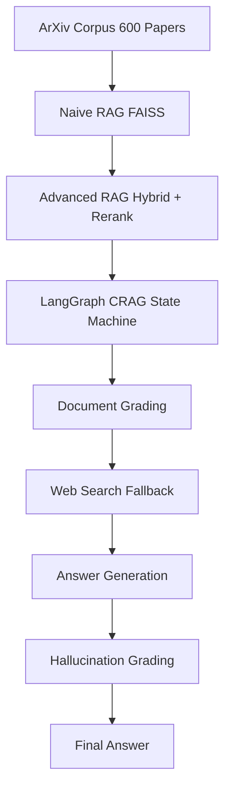
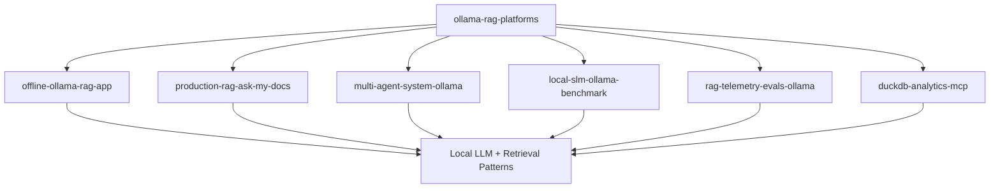
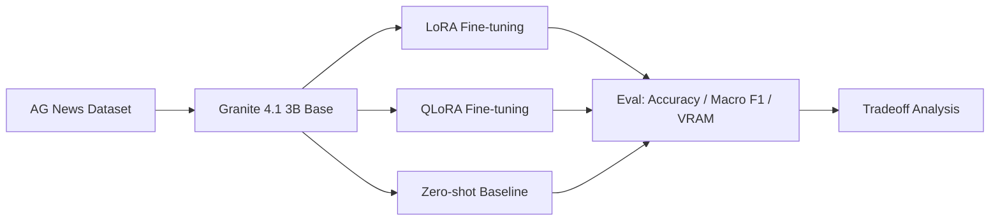

<!-- ======================= HEADER ======================= -->

  

  

    

  

    
    
    
  

 

<!-- ======================= ABOUT ======================= -->
## About

GenAI Engineer at **Deloitte** (July 2025 — present), building document intelligence pipelines, agentic automation systems, and healthcare AI on Azure. Previously **Associate Data Scientist at Cognizant** (Sep 2022 — May 2025), working on warranty analytics, conversational AI, and data pipelines.

**M.Tech** in Data Analytics & Decision Sciences — IIIT Kurnool · **B.Tech** in Computer Science Engineering — MANUU

I treat LLM outputs as unverified signals. Every system I build wraps model calls in structured validation, evaluation loops, and deterministic guardrails.

<!-- ======================= FEATURED REPOSITORIES ======================= -->
## Featured Repositories

### [genai-systems-lab](https://github.com/pypi-ahmad/genai-systems-lab)

Shared execution platform for 20 AI systems (generative pipelines, LangGraph state machines, and CrewAI multi-agent teams) organized behind one repository contract.

**Stack:** Python (`pyproject`/`uv`), Docker · **Signals:** `ARCHITECTURE.md`, `benchmarks/`, `uv run pytest`

---

### [computer-use](https://github.com/pypi-ahmad/computer-use)

Provider-native Computer Use workbench that runs model-driven desktop actions inside an isolated Docker Ubuntu/XFCE sandbox with FastAPI + React.

**Providers in repo:** OpenAI, Anthropic, Gemini · **Signals:** CI badge, API reference, architecture docs, tests badge (`482 passing`)

---

### [agentic-rag-arxiv-research-assistant](https://github.com/pypi-ahmad/agentic-rag-arxiv-research-assistant)

End-to-end Agentic RAG tutorial over ArXiv ML/AI papers, progressing from naive FAISS retrieval to advanced hybrid reranking and LangGraph CRAG.

**Corpus in repo docs:** 600 papers (`cs.CL`, `cs.AI`, `cs.LG`) · **Pipeline:** Naive RAG -> Advanced RAG -> Agentic RAG

---

### [ollama-rag-platforms](https://github.com/pypi-ahmad/ollama-rag-platforms)

Consolidated multi-project repository for local LLM and RAG platform experiments built around Ollama-centric workflows.

**Included modules:** `offline-ollama-rag-app`, `production-rag-ask-my-docs`, `multi-agent-system-ollama`, `local-slm-ollama-benchmark`, `rag-telemetry-evals-ollama`, `duckdb-analytics-mcp`

---

### [granite-lora-qlora-text-classification](https://github.com/pypi-ahmad/granite-lora-qlora-text-classification)

LoRA/QLoRA fine-tuning walkthrough for IBM Granite 4.1 3B on AG News with explicit memory/accuracy tradeoff analysis for consumer GPUs.

**Reported in repo:** baseline `89.15%`, LoRA `95.15%`, QLoRA `94.2%` with lower peak VRAM

---

### [natural-language-to-sql-agent](https://github.com/pypi-ahmad/natural-language-to-sql-agent)

LangGraph + Streamlit application that translates natural-language questions into SQL, executes against SQLite, and returns natural-language answers.

**Stack:** Python, LangGraph, Streamlit, SQLite · **Signals:** test report + repo governance docs

---

### Portfolio

- **Code:** [pypi-ahmad.github.io](https://github.com/pypi-ahmad/pypi-ahmad.github.io)
- **Live:** [pypi-ahmad.github.io](https://pypi-ahmad.github.io)

<!-- ======================= STACK ======================= -->

<h2 align="center">Tech Stack</h2>

<table align="center" width="100%">
  <tr>
    <td align="center" width="20%"><b>GenAI / LLM</b></td>
    <td align="center" width="20%"><b>ML / CV</b></td>
    <td align="center" width="20%"><b>Cloud & DevOps</b></td>
    <td align="center" width="20%"><b>Data</b></td>
    <td align="center" width="20%"><b>Backend & Web</b></td>
  </tr>
  <tr>
    <td align="center" valign="top">
       
       
       
       
       
       
      
    </td>
    <td align="center" valign="top">
       
       
       
      
    </td>
    <td align="center" valign="top">
       
       
      
    </td>
    <td align="center" valign="top">
       
       
       
       
       
       
      
    </td>
    <td align="center" valign="top">
       
       
       
       
       
      
    </td>
  </tr>
</table>

<!-- ======================= STATS ======================= -->
<h2 align="center">Activity</h2>

  
  

  

<!-- Maintainer note: Generated by .github/workflows/github-stats.yml using GH_STATS_TOKEN (required), GH_STATS_EXCLUDE_REPOS and GH_STATS_EXCLUDE_LANGS (optional). -->

  
  

  
  

  

<!-- ======================= DEEP DIVES ======================= -->
## System Design Deep Dives

<b>Agentic RAG over ArXiv (LangGraph CRAG)</b>

 

**Problem:** Naive RAG pipelines over technical corpora often return weak context and hallucinated answers when retrieval quality degrades.

**Architecture:**

```mermaid
flowchart TD
    A[ArXiv Corpus 600 Papers] --> B[Naive RAG FAISS]
    B --> C[Advanced RAG Hybrid + Rerank]
    C --> D[LangGraph CRAG State Machine]
    D --> E[Document Grading]
    E --> F[Web Search Fallback]
    F --> G[Answer Generation]
    G --> H[Hallucination Grading]
    H --> I[Final Answer]
```

**Key components:**
- **Three-stage progression** — naive FAISS baseline, advanced hybrid retrieval, then agentic CRAG orchestration
- **LangGraph state machine** — retrieval, document grading, web-search fallback, generation, hallucination checks
- **Local model stack** — Ollama-hosted embedding + generation models documented in repo setup
- **Evaluation framing** — explicit retrieval comparison and reproducible notebook pipeline

**Repository:** [agentic-rag-arxiv-research-assistant](https://github.com/pypi-ahmad/agentic-rag-arxiv-research-assistant)

<b>Ollama RAG Platforms (Consolidated Portfolio)</b>

 

**Problem:** Local-first RAG and agent projects are often scattered across separate repositories, making comparison and reuse difficult.

**Architecture:**

```mermaid
graph TD;
    A[ollama-rag-platforms] --> B[offline-ollama-rag-app]
    A --> C[production-rag-ask-my-docs]
    A --> D[multi-agent-system-ollama]
    A --> E[local-slm-ollama-benchmark]
    A --> F[rag-telemetry-evals-ollama]
    A --> G[duckdb-analytics-mcp]
    B --> H[Local LLM + Retrieval Patterns]
    C --> H
    D --> H
    E --> H
    F --> H
    G --> H
```

**Key components:**
- **Consolidated structure** — multiple Ollama-centric systems grouped under one repo
- **Coverage breadth** — offline RAG app, production-style docs QA, multi-agent workflows, telemetry/evaluation tooling
- **MCP integration surface** — dedicated DuckDB analytics MCP module in the same portfolio
- **Portfolio orientation** — fast comparison of local LLM architecture patterns across related projects

**Repository:** [ollama-rag-platforms](https://github.com/pypi-ahmad/ollama-rag-platforms)

<b>Granite LoRA vs QLoRA on 8 GB VRAM</b>

 

**Problem:** Fine-tuning LLMs on consumer hardware requires tight memory optimization while maintaining classification quality.

**Architecture:**

```mermaid
flowchart LR
    A[AG News Dataset] --> B[Granite 4.1 3B Base]
    B --> C[Zero-shot Baseline]
    B --> D[LoRA Fine-tuning]
    B --> E[QLoRA Fine-tuning]
    D --> F[Eval: Accuracy / Macro F1 / VRAM]
    E --> F
    C --> F
    F --> G[Tradeoff Analysis]
```

**Key components:**
- **PEFT pipeline** — LoRA and QLoRA adapters over Granite 4.1 3B
- **Quantization path** — 4-bit NF4 QLoRA to reduce VRAM pressure
- **Consumer-GPU target** — documented execution on RTX 4060 8 GB VRAM
- **Reported results in repo** — baseline `89.15%`, LoRA `95.15%`, QLoRA `94.2%`

**Repository:** [granite-lora-qlora-text-classification](https://github.com/pypi-ahmad/granite-lora-qlora-text-classification)

 

<!-- ======================= FOOTER ======================= -->

  

