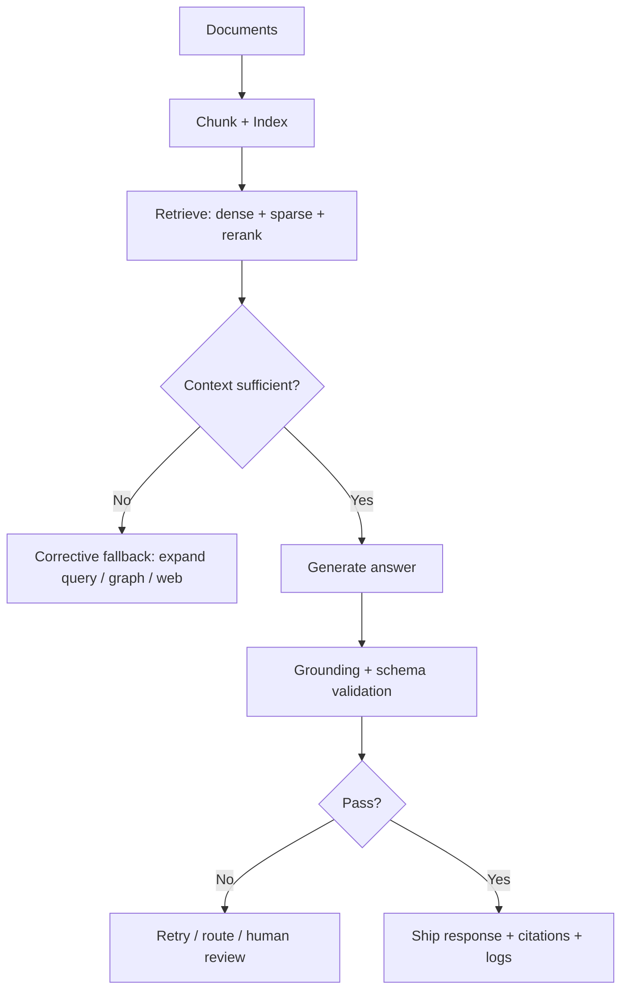

  <h1>Ahmad Mujtaba</h1>
  
<b>Applied AI / GenAI Engineer</b> — Document AI, RAG systems, agentic automation (Python, FastAPI, LangGraph)

  

    
    
    
    
  

  

  <a href="#selected-outcomes">Outcomes</a> ·
  <a href="#featured-work">Featured</a> ·
  <a href="#stack">Stack</a> ·
  <a href="#activity">Activity</a>

## About

GenAI Engineer at **Deloitte** (Jul 2025–present), building production document intelligence pipelines, agentic automation, and healthcare AI on Azure. Previously **Associate Data Scientist at Cognizant** (Sep 2022–May 2025) across warranty analytics, conversational AI, and data pipelines.

I treat LLM outputs as **unverified signals**. Systems ship with structured validation, evaluation loops, and deterministic guardrails.

## Selected Outcomes

- Improved task completion from **38% → 80%** on a **200-task** internal evaluation by engineering a Milvus-backed RAG layer for multi-agent reasoning.
- Reduced browser-agent prompt-token consumption by **~40%** by replacing raw DOM dumps with accessibility-tree snapshots + compressed observations (Playwright MCP tooling).
- Improved structured extraction accuracy from **80–81% → 90%+** (multi-pass extraction with confidence-aware retries + routing).
- Raised policy-entity extraction accuracy from **90% → 99%** via model + validation iteration (prompting, canonical comparisons, and evaluation).

## Featured Work

These are the repos I recommend pinning (recruiter-first, “proof in the repo”).

| Project | What it is | Signal |
|---|---|---|
| [`medical-document-intelligence-assistant`](https://github.com/pypi-ahmad/medical-document-intelligence-assistant) | Local-first medical document understanding platform (OCR, extraction, retrieval, citations) | Verified end-to-end run, artifacts, large test suite |
| [`local-agentic-enterprise-platform`](https://github.com/pypi-ahmad/local-agentic-enterprise-platform) | Local AI business automation platform with approvals, reporting exports, and full web UI | Real e2e run + generated artifacts |
| [`legal-graphrag`](https://github.com/pypi-ahmad/legal-graphrag) | Legal GraphRAG stack with dense/sparse/graph/agentic/multimodal retrieval + eval | Metrics backed by artifact JSON outputs |
| [`computer-use`](https://github.com/pypi-ahmad/computer-use) | Provider-native computer-use workbench running inside an isolated Docker desktop sandbox | CI + docs + API surface |
| [`ai-ats-latex-resume-builder`](https://github.com/pypi-ahmad/ai-ats-latex-resume-builder) | AI resume builder: OCR/vision extraction + market snippets + LaTeX generation + PDF compile | Tests + end-to-end workflow doc |
| [`invoiceflow-ai`](https://github.com/pypi-ahmad/invoiceflow-ai) | Invoice processing pipeline with vision extraction, validation, semantic matching, and review UI | Clear module architecture + tests |

Other highlights:
- [`genai-systems-lab`](https://github.com/pypi-ahmad/genai-systems-lab) (collection of production-grade GenAI systems behind one repo contract)
- [`pypi-ahmad.github.io`](https://github.com/pypi-ahmad/pypi-ahmad.github.io) (portfolio site code + tests)
- [`Clinical-Decision-Support-System`](https://github.com/pypi-ahmad/Clinical-Decision-Support-System) (CDS-style document pipeline with strong security + LangGraph story)

## Stack

  

## Activity

<b>GitHub stats (collapsible)</b>

 

  
  

  

<!-- Generated by .github/workflows/github-stats.yml using GH_STATS_TOKEN (required). -->

  
  

  
  

  

## One Deep Dive (Optional)

<b>How I build RAG systems that don’t lie by default</b>

 

I structure RAG as an engineering system: retrieval quality + grounded generation + evaluation + guardrails.

```mermaid
flowchart TD
  A[Documents] --> B[Chunk + Index]
  B --> C[Retrieve: dense + sparse + rerank]
  C --> D{Context sufficient?}
  D -->|No| E[Corrective fallback: expand query / graph / web]
  D -->|Yes| F[Generate answer]
  F --> G[Grounding + schema validation]
  G --> H{Pass?}
  H -->|No| I[Retry / route / human review]
  H -->|Yes| J[Ship response + citations + logs]
```

If you want concrete, reproducible examples, see:
- [`legal-graphrag`](https://github.com/pypi-ahmad/legal-graphrag)
- [`agentic-rag-arxiv-research-assistant`](https://github.com/pypi-ahmad/agentic-rag-arxiv-research-assistant)

  

