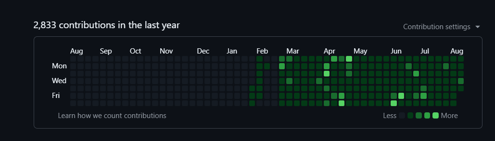
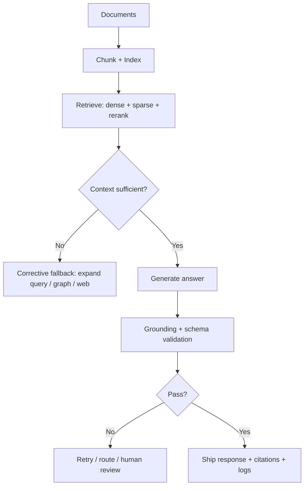

  <h1>Ahmad Mujtaba</h1>
  
<b>Applied AI Engineer building reliable Document AI, RAG, and agentic systems.</b>

  
Production experience in evaluation, structured extraction, healthcare AI, and Azure deployments.

  

    
    
    
  

  <a href="#selected-outcomes">Outcomes</a> ·
  <a href="#featured-work">Featured</a> ·
  <a href="#stack">Stack</a> ·
  <a href="#activity">Activity</a>

## About

GenAI Engineer at **Deloitte** (Jul 2025–present), building production document intelligence pipelines, agentic automation, and healthcare AI on Azure. Previously **Associate Data Scientist at Cognizant** (Sep 2022–May 2025) across warranty analytics, conversational AI, and data pipelines.

I treat LLM outputs as **unverified signals**. Systems ship with structured validation, evaluation loops, and deterministic guardrails.

## Selected Outcomes

- Improved task completion from **38% → 80%** on a **200-task** internal evaluation by engineering a Milvus-backed RAG layer for multi-agent reasoning.
- Reduced browser-agent prompt-token consumption by **~40%** by replacing raw DOM dumps with accessibility-tree snapshots + compressed observations (Playwright MCP tooling).
- Improved structured extraction accuracy from **80–81% → 90%+** (multi-pass extraction with confidence-aware retries + routing).
- Raised policy-entity extraction accuracy from **90% → 99%** via model + validation iteration (prompting, canonical comparisons, and evaluation).

## Featured Work

Four projects that demonstrate local model training, computer-use agents, multi-provider AI workspaces, and grounded document extraction.

### LoRA Fine-tune Studio

**Problem.** Local adapter training is fragmented across hardware checks, dataset preparation, recipe configuration, checkpoint recovery, and evaluation.

**Built.** A guided Windows/Linux studio that validates datasets, detects CUDA and VRAM, runs isolated training jobs with cancellation and checkpoint resume, compares adapters with base models, and optionally publishes adapters to Hugging Face Hub.

**Stack.** `Python · Streamlit · PyTorch · Transformers · TRL · PEFT · Unsloth`

**Evidence.** Supports five training approaches—SFT, Reward, DPO, KTO, and ORPO—across LoRA, QLoRA, OFT, and QOFT, with eight focused workflow pages, eight test modules, and CI.

[Code](https://github.com/pypi-ahmad/lora-qlora-fine-tuning-app) · [Screenshot](https://github.com/pypi-ahmad/lora-qlora-fine-tuning-app/blob/main/docs/images/training-studio.png) · [Setup](https://github.com/pypi-ahmad/lora-qlora-fine-tuning-app#install-from-github) · [Architecture](https://github.com/pypi-ahmad/lora-qlora-fine-tuning-app/blob/main/TECHNICAL.md) · [Tests](https://github.com/pypi-ahmad/lora-qlora-fine-tuning-app/tree/main/tests)

### Computer Use Workbench

**Problem.** Provider-native computer-use agents expose different tool contracts, execution loops, and safety controls, making them difficult to compare and operate consistently.

**Built.** A local workbench with explicit OpenAI, Anthropic, and Google execution routes, a sandboxed Ubuntu/XFCE desktop, controlled fallback behavior, short-lived credentials, and retained audit frames.

**Stack.** `Python · FastAPI · React 19 · SQLite · Docker · OpenAI · Anthropic · Gemini`

**Evidence.** Implements three direct provider routes, limits credentials to eight hours, bounds audit retention to seven days or 1 GiB, and gates releases with backend/frontend tests, dependency audits, sandbox builds, and high/critical image scanning.

[Code](https://github.com/pypi-ahmad/computer-use) · [Screenshot](https://github.com/pypi-ahmad/computer-use/blob/main/assets/screenshot.png) · [Setup](https://github.com/pypi-ahmad/computer-use#quick-start) · [Architecture](https://github.com/pypi-ahmad/computer-use/blob/main/TECHNICAL.md) · [Tests](https://github.com/pypi-ahmad/computer-use/tree/main/tests)

### Local AI Chat Studio

**Problem.** Local and hosted models usually require separate clients, making side-by-side comparison, provenance, and context control difficult.

**Built.** A local-first workspace with streaming chat, compare/replay/diff workflows, context-budget pruning, provenance receipts, prompt-injection quarantine, secret and PII warnings, and local memory/RAG.

**Stack.** `Python · FastAPI · React 19 · SQLite · ChromaDB · Ollama`

**Evidence.** Runs Ollama locally and supports optional OpenAI, Anthropic, Gemini, OpenRouter, xAI, OpenCode, and compatible gateway routes, with CI covering provider/API contracts, workspace behavior, frontend tests, linting, and production builds.

[Code](https://github.com/pypi-ahmad/local-ai-chat-studio) · [Screenshot](https://github.com/pypi-ahmad/local-ai-chat-studio/blob/main/docs/screenshot-chat.png) · [Setup](https://github.com/pypi-ahmad/local-ai-chat-studio#install-and-run) · [Architecture](https://github.com/pypi-ahmad/local-ai-chat-studio/blob/main/TECHNICAL.md) · [Tests](https://github.com/pypi-ahmad/local-ai-chat-studio/tree/main/tests)

### Grounded Document Parser

**Problem.** Extracting structured data from complex PDFs requires page-level grounding, stable ordering, review routing, and recoverable failures—not untraceable free-form generation.

**Built.** A grounded parser that renders every page to pixels, analyzes pages concurrently, produces ordered Markdown/JSON, routes custom forms by confidence, and preserves isolated failures as warnings.

**Stack.** `Python · Streamlit · Pydantic · OpenAI · GLM-OCR`

**Evidence.** Processes ordered 16-page windows with up to eight page workers, routes classifications below 85% confidence for review, and verifies extraction, routing, recovery, evaluation, and UI contracts across 22 test modules.

[Code](https://github.com/pypi-ahmad/grounded-docparse) · [Screenshot](https://github.com/pypi-ahmad/grounded-docparse/blob/main/docs/images/document-parse-studio-full.png) · [Setup](https://github.com/pypi-ahmad/grounded-docparse#install-and-set-up) · [Architecture](https://github.com/pypi-ahmad/grounded-docparse/blob/main/docs/architecture.md) · [Tests](https://github.com/pypi-ahmad/grounded-docparse/tree/main/tests)

## Stack

  

## Activity

<b>GitHub stats (collapsible)</b>

 

  

<!-- Generated by .github/workflows/github-stats.yml using GH_STATS_TOKEN (required). -->

  
  

  
  

  

  <picture>
    <source media="(prefers-color-scheme: dark)" srcset="https://raw.githubusercontent.com/pypi-ahmad/pypi-ahmad/main/profile-3d-contrib/profile-night-rainbow.svg" />
    <source media="(prefers-color-scheme: light)" srcset="https://raw.githubusercontent.com/pypi-ahmad/pypi-ahmad/main/profile-3d-contrib/profile-green.svg" />
    
  </picture>

## One Deep Dive (Optional)

<b>How I build RAG systems that don’t lie by default</b>

 

I structure RAG as an engineering system: retrieval quality + grounded generation + evaluation + guardrails.

```mermaid
flowchart TD
  A[Documents] --> B[Chunk + Index]
  B --> C[Retrieve: dense + sparse + rerank]
  C --> D{Context sufficient?}
  D -->|No| E[Corrective fallback: expand query / graph / web]
  D -->|Yes| F[Generate answer]
  F --> G[Grounding + schema validation]
  G --> H{Pass?}
  H -->|No| I[Retry / route / human review]
  H -->|Yes| J[Ship response + citations + logs]
```

If you want concrete, reproducible examples, see:
- [`legal-graphrag`](https://github.com/pypi-ahmad/legal-graphrag)
- [`agentic-rag-arxiv-research-assistant`](https://github.com/pypi-ahmad/agentic-rag-arxiv-research-assistant)

  

