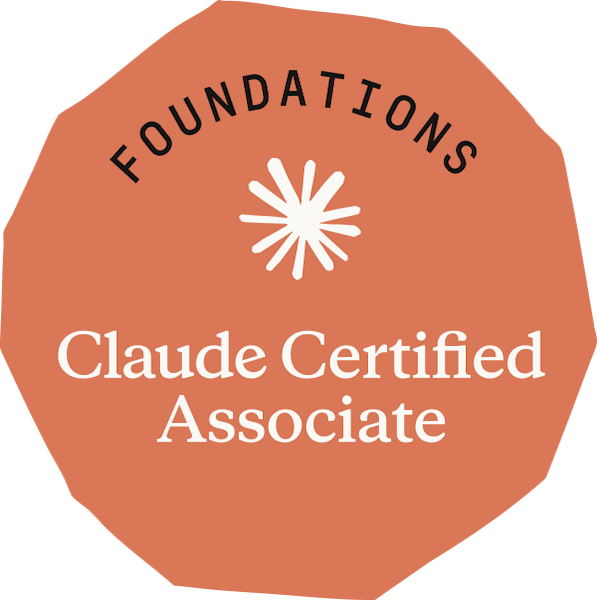

  <h1>Ahmad Mujtaba</h1>
  <h3>AI &amp; Data Science Engineer · Production AI · Deloitte US-India</h3>
  
<b>Production AI Engineer focused on multimodal document intelligence, LLM extraction architectures, agentic workflows, and LLM evaluation.</b>

  
Document AI · Retrieval · Agentic Systems · Evaluation · Event-Driven Cloud

  

    
    
    
  

  <a href="#measured-outcomes">Outcomes</a> ·
  <a href="#professional-experience">Experience</a> ·
  <a href="#case-studies">Case Studies</a> ·
  <a href="#public-projects">Projects</a> ·
  <a href="#skills-with-context">Skills</a> ·
  <a href="#forward-deployed-ai-engineering">FDE Path</a> ·
  <a href="#education--credentials">Education</a> ·
  <a href="#github-statistics">Statistics</a> ·
  <a href="#contact--availability">Contact</a>

## About

I am a production AI engineer specializing in multimodal document intelligence, LLM extraction architectures, agentic workflows, and LLM evaluation. At Deloitte, I work on healthcare document processing, retrieval and computer-use workflows, and healthcare integrity analytics. At Cognizant, I improved production machine-learning and NLP systems, built conversational AI, and helped move expensive processing into event-driven Azure services.

My work began in ML, NLP, and data science, expanded into conversational AI, and now includes GenAI and agentic AI. Evaluation and operational reliability have stayed central throughout.

### How I work

I begin by researching existing solutions and comparing model quality and cost. I inspect early results manually, regression-test changes, preserve source evidence, and monitor systems after delivery. I prefer typed boundaries, explicit failure states, human review where needed, and claims that remain inside the available evidence.

## Measured Outcomes

These are team and system results from internal employer evaluations. My contribution is stated separately. Client identities, internal project names, source data, prompts, schemas, thresholds, scoring details, and proprietary code are omitted. Related public projects demonstrate engineering patterns; they do not reproduce these measurements.

| Outcome | Evaluation context | My contribution |
|---|---|---|
| **95%+ fax-classification accuracy** | Deloitte; measured across 500-file bulk batches. | Worked on Azure Databricks classification and routing for fax intake. |
| **80–81% to 92%+ structured-extraction accuracy** | Deloitte; recurring 100-file internal evaluation runs. | Designed grouped extraction, confidence-aware four-pass extraction, retries, validation, and routing. |
| **38% to 80% browser task completion** | Deloitte; the same 200-task internal evaluation. | Contributed Milvus retrieval, reranking, and failure-aware routing. |
| **~40% lower browser-agent prompt-token use** | Deloitte; internal comparison against raw DOM observations. | Built accessibility-tree snapshots and compressed observations. |
| **90% to 99% policy-entity extraction accuracy** | Deloitte; the same internal benchmark. | Iterated prompts, implemented canonical comparison, and expanded evaluation. |
| **79% to 88% warranty-classifier recall** | Cognizant; reported internal classifier evaluation. | Retrained and tuned Random Forest, compared XGBoost, and retained Random Forest based on results. |

[Read the portfolio experience](https://pypi-ahmad.github.io/experience) · [Review the sanitized outcome boundaries](docs/sanitized-outcomes.md)

## Professional Experience

### AI & Data Science Engineer · Deloitte US-India

**July 2025 – Present · Gurugram, India**

<b>Prior-authorization document processing</b>

 

A production Azure pipeline processes incoming healthcare fax packets from classification through extraction, validation, routing, and recovery. Handwriting, nonstandard forms, business rules, and a 117-field schema made a single extraction call unreliable.

- Used Azure Content Understanding to generate Markdown, then Azure OpenAI to extract structured values.
- Designed the production revision around **seven calls grouping related fields**, replacing one request for all 117 fields.
- Designed confidence-aware **four-pass extraction**, retries, validation, and explicit recovery outcomes.
- Migrated GPT-4.1 prompts to GPT-5.2 and checked the revision with manual review and regression tests.
- Kept classification and extraction separate, producing RPA-ready CSV/JSON and annotated PDFs.
- The grouped extraction revision went live in **September 2026**.

[Detailed experience](https://pypi-ahmad.github.io/experience#prior-authorization)

<b>Healthcare integrity and fraud analytics</b>

 

- Partnered with clinical, operational, and business stakeholders to map workflows and document PHI-aware solution designs, delivery risks, and implementation guidance.
- Built a seven-agent LangGraph and GPT-4o Vision workflow that combined visual, metadata, and semantic document checks with NPI/EIN validation and deterministic 0–100 risk scoring.
- Developed out-of-network claims and referral-pattern analysis with approval gates, evidence review, investigator-facing dashboards, and report generation.

[Detailed experience](https://pypi-ahmad.github.io/experience#healthcare-integrity)

<b>Computer-use and multi-agent reasoning</b>

 

- Contributed Milvus retrieval, reranking, and failure-aware routing to a computer-use workflow.
- Built a Playwright MCP tool using accessibility-tree snapshots and compressed-vision context instead of raw DOM observations.
- Task completion and prompt-token use were evaluated as separate outcomes.

[Detailed experience](https://pypi-ahmad.github.io/experience#computer-use)

<b>Policy-entity extraction</b>

 

Iterated prompts, implemented canonical comparison, and expanded evaluation for structured policy-entity extraction used in care-management decision support.

[Detailed experience](https://pypi-ahmad.github.io/experience#policy-entity-extraction)

### Associate Data Scientist · Cognizant Technology Solutions

**September 2022 – May 2025 · Noida, India**

<b>Warranty decisions, NLP processing, and operational monitoring</b>

 

- Improved an automotive warranty workflow handling roughly 1,800–2,200 claims per weekday and approximately 1,000 per weekend day.
- Retrained and tuned its existing Random Forest classifier, compared XGBoost, and retained Random Forest because XGBoost did not outperform it.
- Prioritized recall because missing a legitimate claim carried a higher business cost than additional review.
- Migrated legacy LUIS intent and entity processing to Azure Conversational Language Understanding.
- Helped move expensive downstream processing out of the FastAPI request path through Azure Blob Storage and Azure Functions after HTTP 504 timeouts under a 30-second SLA.
- Built Power BI analytics, model-behavior, and drift dashboards.

[Detailed experience](https://pypi-ahmad.github.io/experience#warranty-processing)

<b>Conversational B2B reordering</b>

 

For a separate FMCG engagement, built a conversational reordering workflow using AWS Lex, Azure OpenAI, AWS Lambda, and Amazon S3.

### Machine Learning Engineer Intern · AiEnsured

**July 2021 – August 2021 · Remote, India**

- Supported CNN-based object-detection work, including code optimization and error analysis.
- Implemented regression and classification models and contributed to feature-engineering experiments.

### Architecture snapshots

1. **Prior authorization:** Fax documents → type and urgency classification → eligible documents → Azure Content Understanding Markdown → grouped Azure OpenAI extraction → validation and business rules → structured output or review.
2. **Computer use:** Retrieved knowledge and browser observations → multi-agent reasoning → tool execution → explicit routing and failure handling.
3. **Warranty processing:** Standard claim scoring remains separate from NLP processing; accepted payloads move through Blob Storage to Azure Functions for downstream work.

[View the architecture diagrams](https://pypi-ahmad.github.io/experience)

## Case Studies

These five studies cover independent tools and research. The Document AI repositories compare different approaches and remain separate applications.

<b>Document AI Engineering Lab · Document AI, Extraction, GraphRAG</b>

 

Scans, handwriting, tables, and native documents call for different processing strategies. Readable text alone is insufficient when extracted fields and answers need evidence a person can inspect.

The lab contains eight separate implementations for local OCR, multimodal parsing, schema extraction, annotated review artifacts, and GraphRAG question answering. They keep source evidence distinct from model interpretation, make local and cloud processing comparisons explicit, and treat document Q&A separately from parsing.

The repositories expose processing paths, output contracts, and review artifacts. They do not establish a shared accuracy benchmark or parity with a commercial extraction service, and privacy and provider boundaries differ by implementation.

| Implementation | Approach |
|---|---|
| [Paperplane](https://github.com/pypi-ahmad/Agentic-Document-Extraction) | Explicit parsing engines with grounded Markdown, JSON, and document organization. |
| [Document Intelligence Agent](https://github.com/pypi-ahmad/document-intelligence-agent) | GraphRAG retrieval, verification, and cross-document comparison. |
| [Grounded DocParse](https://github.com/pypi-ahmad/grounded-docparse) | Mixed-format parsing with immutable source spans and evidence-linked extraction. |
| [OpenAI + RapidOCR](https://github.com/pypi-ahmad/OpenAI-X-RapidOCR-Agentic-Document_extraction) | Local OCR and layout evidence followed by multimodal refinement. |
| [OpenAI Agentic Document Extraction](https://github.com/pypi-ahmad/OpenAI-Agentic-Document_extraction) | Model-cascade extraction, segment verification, and disputed-field resolution. |
| [NaviDC-OCR Studio](https://github.com/pypi-ahmad/NaviDC-OCR-Agentic-Document-Extraction) | Local GPU OCR with optional cloud-based semantic field extraction. |
| [LiteParse Agentic Extraction](https://github.com/pypi-ahmad/liteparse-agentic-document-extraction) | Layout reconstruction with model OCR and targeted hard-region verification. |
| [ADE workflow example](https://github.com/pypi-ahmad/ai-projects/tree/main/16-Agentic-Document-Extraction) | Bounded LangGraph parsing that produces Markdown, HTML, and annotated pages. |

<b>LoRA Fine-tune Studio · Model Training, Fine-Tuning</b>

 

Local fine-tuning depends on dataset compatibility, GPU capacity, run configuration, recovery, and adapter review. This Streamlit workflow covers dataset preparation, model inspection, parameter-efficient training, job monitoring, and base-versus-adapter comparison. It saves portable PEFT adapters and maintains a persistent local job queue.

Runs are validated before launch, GPU workers are isolated, and the queue processes one run at a time. The app supports cancellation, logs, and checkpoint recovery, alongside a CUDA-free synthetic showcase.

The repository includes the training implementation, example datasets, workflow documentation, and a read-only showcase. Adapter quality depends on the selected data, model, and recipe. It is a single-user local experiment environment and does not provide hosted or distributed training; the separate showcase performs no training.

[Repository](https://github.com/pypi-ahmad/lora-qlora-fine-tuning-app) · [Portfolio study](https://pypi-ahmad.github.io/projects#lora-fine-tune-studio)

<b>Self-Improving Prompt Optimizer · Evaluation, Prompt Optimization</b>

 

A prompt that looks better on one example may perform worse elsewhere, so alternatives need a consistent evaluation set and visible scoring trade-offs. This LangGraph workflow generates diverse prompt candidates, evaluates them against the same selected benchmark, and maintains an elite pool. Streamlit shows scores, Pareto trade-offs, per-case results, and downloadable history.

Every candidate is evaluated against the same selected benchmark. The workflow supports weighted, Pareto, and hybrid selection, caches exact prompt scores, and retains the strongest candidate across generations.

Candidate generation and judge-based scoring remain inspectable. A higher judge score is an experimental result rather than evidence of general improvement outside the selected benchmark. Evaluation is sequential, run state is in memory, and the repository has no automated test suite. Judge quality and benchmark coverage constrain the conclusions.

[Repository](https://github.com/pypi-ahmad/self-improving-prompt-optimizer) · [Portfolio study](https://pypi-ahmad.github.io/projects#self-improving-prompt-optimizer)

<b>Video Summarizer · Multimodal AI, Retrieval</b>

 

Reprocessing a complete video for every task repeats work over the same speech and visual evidence. This local Streamlit workspace uses Adversal’s remote MCP video analysis and reuses returned Markdown, timestamps, and frames. Qdrant supports video-scoped retrieval for questions and generated documents, while persisted request IDs allow monitoring and recovery.

Completed source artifacts, request identifiers, and job state are retained; retrieval stays scoped to the selected video; and generated answers expose their source material.

The repository includes job lifecycle handling, evidence indexing, export workflows, and focused tests using service mocks. Adversal supplies the underlying video-understanding service. Video understanding and model calls use external services, one video workspace is active per browser session, and generated documents and chat history remain session-scoped.

[Repository](https://github.com/pypi-ahmad/video-summarizer) · [Portfolio study](https://pypi-ahmad.github.io/projects#video-summarizer)

<b>Hinglish Turn Detection · Speech ML, Evaluation</b>

 

A pause is not always a finished utterance, and false-complete decisions can cause a voice agent to interrupt the speaker. The study compares Whisper-tiny-based audio classifiers, pooling and augmentation strategies, an audio-text variant, and a three-seed finalist with validation-calibrated thresholds.

It tracks false-complete rate alongside recall and F1, selects the final architecture and threshold from validation results before held-out evaluation, and compares audio-only and audio-text approaches for both quality and live inference overhead.

The selected checkpoint achieved a **9.84% false-complete rate** and **83.26% recall** on **4,890 held-out examples**. Recall missed the desired 85% target. The data lacks verified Hinglish/code-switch labels and speaker IDs, and much of the training audio is synthetic, so this is not a speaker-disjoint benchmark of real human Hinglish conversations.

[Repository](https://github.com/pypi-ahmad/hinglish-turn-detection) · [Demo](https://huggingface.co/spaces/pypi-ahmad/hinglish-turn-detection) · [Portfolio study](https://pypi-ahmad.github.io/projects#hinglish-turn-detection)

## Public Projects

| Project | Focus | What it does |
|---|---|---|
| [LoRA Fine-tune Studio](https://github.com/pypi-ahmad/lora-qlora-fine-tuning-app) | Model Training · Fine-Tuning | Prepares datasets, trains local LLM adapters, monitors jobs, and compares adapters with base models. |
| [Tool-Using Browser Agent](https://github.com/pypi-ahmad/tool-using-browser-agent) | Agentic AI · Browser Automation | Plans and performs Playwright actions with memory and human approval before sensitive steps. |
| [Self-Improving Prompt Optimizer](https://github.com/pypi-ahmad/self-improving-prompt-optimizer) | Evaluation · Prompt Optimization | Generates and compares prompt candidates with multi-objective LLM-as-judge scoring. |
| [NL2SQL Agent](https://github.com/pypi-ahmad/natural-language-to-sql-agent) | Agentic AI · Data Systems | Produces reviewed SQL for SQLite and PostgreSQL with audit trails and local or hosted models. |
| [Autonomous Coding Agent Crew](https://github.com/pypi-ahmad/autonomous-coding-agent-crew) | Agentic AI · Developer Tools | Coordinates planning, specialists, review, testing, debugging, documentation, and quality gates. |
| [Multi-Agent Debate Decision System](https://github.com/pypi-ahmad/multi-agent-debate-decision-system) | Multi-Agent AI · Decision Support | Runs moderated debates with structured judging, confidence, recommendations, and risks. |
| [Multi-Agent Research Assistant](https://github.com/pypi-ahmad/multi-agent-research-assistant) | Multi-Agent AI · Research | Coordinates planning, parallel research, critique, reflection, and cited report writing. |
| [Local-First Knowledge Base Agent](https://github.com/pypi-ahmad/local-first-knowledge-base-agent) | Local AI · Knowledge Systems | Indexes personal knowledge for cited answers, temporal reasoning, and local knowledge graphs. |
| [Intelligent Personal Finance Agent](https://github.com/pypi-ahmad/intelligent-personal-finance-agent) | Local AI · Personal Finance | Ingests statements, learns category corrections, and keeps the ledger on the user’s machine. |
| [Document Intelligence Agent](https://github.com/pypi-ahmad/document-intelligence-agent) | Document AI · GraphRAG | Uses LangGraph and ArcadeDB for extraction, community detection, retrieval, and verification. |
| [Autonomous Job Application Agent](https://github.com/pypi-ahmad/autonomous-job-application-agent) | Agentic AI · Workflow Automation | Collects and scores jobs, drafts tailored content, and tracks applications locally with human review. |
| [AutoTabML Studio](https://github.com/pypi-ahmad/AutoTabML-Studio) | Machine Learning · AutoML | Turns tabular data into trained, evaluated, deployable models through reproducible UI and CLI workflows. |
| [Codebase Understanding Agent](https://github.com/pypi-ahmad/codebase-understanding-agent) | Agentic AI · Developer Tools | Clones, scans, summarizes, and explains repositories, then answers codebase questions through chat. |

[Explore the complete projects page](https://pypi-ahmad.github.io/projects)

## Repository Showcase

  <a href="https://github.com/pypi-ahmad/computer-use">
    <picture>
      <source media="(prefers-color-scheme: dark)" srcset="https://raw.githubusercontent.com/pypi-ahmad/pypi-ahmad/cards/cards/computer-use.dark.svg" />
      <source media="(prefers-color-scheme: light)" srcset="https://raw.githubusercontent.com/pypi-ahmad/pypi-ahmad/cards/cards/computer-use.light.svg" />
      
    </picture>
  </a>
  <a href="https://github.com/pypi-ahmad/grounded-docparse">
    <picture>
      <source media="(prefers-color-scheme: dark)" srcset="https://raw.githubusercontent.com/pypi-ahmad/pypi-ahmad/cards/cards/grounded-docparse.dark.svg" />
      <source media="(prefers-color-scheme: light)" srcset="https://raw.githubusercontent.com/pypi-ahmad/pypi-ahmad/cards/cards/grounded-docparse.light.svg" />
      
    </picture>
  </a>
  <a href="https://github.com/pypi-ahmad/Agentic-Document-Extraction">
    <picture>
      <source media="(prefers-color-scheme: dark)" srcset="https://raw.githubusercontent.com/pypi-ahmad/pypi-ahmad/cards/cards/Agentic-Document-Extraction.dark.svg" />
      <source media="(prefers-color-scheme: light)" srcset="https://raw.githubusercontent.com/pypi-ahmad/pypi-ahmad/cards/cards/Agentic-Document-Extraction.light.svg" />
      
    </picture>
  </a>
  <a href="https://github.com/pypi-ahmad/local-ai-chat-studio">
    <picture>
      <source media="(prefers-color-scheme: dark)" srcset="https://raw.githubusercontent.com/pypi-ahmad/pypi-ahmad/cards/cards/local-ai-chat-studio.dark.svg" />
      <source media="(prefers-color-scheme: light)" srcset="https://raw.githubusercontent.com/pypi-ahmad/pypi-ahmad/cards/cards/local-ai-chat-studio.light.svg" />
      
    </picture>
  </a>

## Skills, with Context

### Core capabilities

- **LLM architectures and agentic workflows:** context engineering and prompt hardening for structured workflows; separate agentic systems add tools, planning, approval gates, memory, retries, and explicit failure handling.
- **Retrieval and knowledge systems:** hybrid retrieval, reranking, graph traversal, citations, and local-first memory for grounded answers.
- **Multimodal document intelligence:** layout-aware extraction from scanned and handwritten faxes using Azure Content Understanding and Azure OpenAI, with grouped fields, confidence-aware retries, schema validation, and human review.
- **Evaluation and production ML:** Random Forest retraining, XGBoost comparison, recall-led evaluation, drift dashboards, prompt regression checks, fixed internal benchmarks, and personal experiments in LLM-as-judge evaluation and LoRA/QLoRA.
- **Event-driven cloud and backend systems:** Python and FastAPI services with downstream Azure Blob Storage and Functions processing; schema-first contracts, local/cloud model routing, reproducible environments, and deployment controls in public projects.

### AI system lifecycle

**Data → Retrieval → Model → Agent → State → API → Deployment → Evaluation → Observability → Iteration**

The [measured outcomes](#measured-outcomes) and linked project stories show how these capabilities were applied and evaluated.

### Professional delivery

| Tools | Applied context |
|---|---|
| Azure OpenAI, Azure Content Understanding, Azure Databricks | Grouped LLM extraction over CU Markdown with confidence-aware four-pass extraction and validation. |
| LangGraph, GPT-4o Vision, Streamlit | Specialist document checks, deterministic risk scoring, evidence review, and investigator-facing reporting. |
| Milvus, Playwright, MCP | Retrieval, reranking, and efficient browser observations for multi-agent reasoning. |
| Python, FastAPI, Azure App Service, Blob Storage, Functions, CLU, Random Forest, XGBoost, Power BI | Warranty classification, NLP migration, downstream processing, analytics, and drift monitoring. |
| AWS Lex, Azure OpenAI, Lambda, S3 | Conversational B2B reordering for a separate FMCG engagement. |

### Personal project tooling

| Tools | Public implementation |
|---|---|
| LangChain, Anthropic, Gemini, Ollama, Pydantic, SQLite, PostgreSQL | [NL2SQL Agent](https://github.com/pypi-ahmad/natural-language-to-sql-agent) |
| PyTorch, Transformers, PEFT, TRL | [LoRA Fine-tune Studio](https://github.com/pypi-ahmad/lora-qlora-fine-tuning-app) |
| Chroma | [Google OKF implementation](https://github.com/pypi-ahmad/google-okf-implementation) |
| ArcadeDB, LangGraph | [Document Intelligence Agent](https://github.com/pypi-ahmad/document-intelligence-agent) |
| Docker, GitHub Actions, Qdrant | [Video Summarizer](https://github.com/pypi-ahmad/video-summarizer) |

<b>Current learning interests</b>

 

These learning interests do not represent claims of production expertise.

- **Agentic AI and orchestration:** LangGraph + MCP, AutoGen, CrewAI, multi-agent systems
- **Reasoning models and post-training:** test-time compute scaling, GRPO, DPO
- **Evaluation and AI governance:** LLM-as-a-Judge, DeepEval, NeMo Guardrails, red-teaming, precision-recall curves
- **Edge AI and high-throughput inference:** vLLM, SGLang, Ollama, FP4/FP8 quantization, AWQ
- **Agentic RAG and GraphRAG:** Neo4j, LlamaIndex Workflows, vector databases, hybrid search
- **Multimodal and vision-language AI:** VLMs, Document AI, audio-to-audio systems
- **Cloud events and observability:** Azure Event Grid, Application Insights

[Explore skills with project context](https://pypi-ahmad.github.io/skills)

## Forward-Deployed AI Engineering

I am building on professional experience and independent projects to learn forward-deployed AI engineering. The path is ongoing and does not represent a completed curriculum, an employment title, or ownership of the full customer lifecycle.

1. **Problem discovery (professional experience):** Partnered with clinical, operational, and business stakeholders to map workflows and document PHI-aware solution designs.
2. **Solution definition (professional experience):** Documented delivery risks, constraints, and implementation guidance connecting workflow requirements to engineering decisions.
3. **AI prototyping (professional experience):** Iterated structured extraction and prompts, compared model behavior, and inspected intermediate Markdown for omissions and hallucinations.
4. **Retrieval systems (professional experience):** Contributed Milvus retrieval, reranking, and failure-aware routing to computer-use and multi-agent reasoning.
5. **Agentic systems (professional experience):** Built LangGraph specialist checks combining visual, metadata, and semantic evidence with review and reporting.
6. **State and recovery (personal projects):** Built persistent training queues and checkpoint recovery, plus resumable video-analysis requests and saved job state.
7. **Deployment and integration (professional experience):** Helped decouple expensive warranty processing through Azure Blob Storage and Azure Functions.
8. **Operational monitoring (professional experience):** Built analytics and model-drift dashboards for changing claim behavior and service issues.
9. **Evaluation and iteration (professional experience):** Used manual review and regression testing with confidence-aware extraction, retries, and validation.

[Follow the evidence-backed FDE journey](https://pypi-ahmad.github.io/fde)

## Education & Credentials

### Degrees

- **M.Tech in Data Analytics and Decision Sciences**, Indian Institute of Information Technology Kurnool, October 2020 to June 2022. Coursework included machine learning, deep learning, NLP, computer vision, and statistics.
- **B.Tech in Computer Science Engineering**, Maulana Azad National Urdu University, August 2015 to June 2019. Coursework included data structures and algorithms, engineering mathematics, and web development.

### Professional certification

<b>Claude Certified Associate - Foundations · Anthropic</b>

 

  
  

    <b>Claude Certified Associate - Foundations</b> 
    Issued August 31, 2026 
    <a href="https://www.credly.com/badges/d9eace76-da4e-447f-b38b-9c39ac6edf6d">Verify on Credly</a>
  

### Course certificates

<b>Anthropic Education certificates (4)</b>

 

  
  
   
  
  

- [Claude Code 101](https://verify.skilljar.com/c/uubk52krkzap) — completed August 18, 2026
- [Building with the Claude API](https://verify.skilljar.com/c/2njdrsdeigc4) — completed July 6, 2026
- [Claude 101](https://verify.skilljar.com/c/b3ejcctoop7p) — completed March 10, 2026
- [AI Fluency: Framework & Foundations](https://verify.skilljar.com/c/suzvk58nwng2) — completed March 11, 2026

<b>Machine learning, deep learning, data science, and SQL certificates (9)</b>

 

- [Machine Learning Specialization](https://coursera.org/verify/specialization/2T5GNSDSV29S) — DeepLearning.AI / Stanford via Coursera
- [Advanced Learning Algorithms](https://coursera.org/verify/P9GJ4PVXL9UW) — DeepLearning.AI / Stanford via Coursera
- [Supervised Machine Learning](https://coursera.org/verify/4Q4USU8YJYY6) — DeepLearning.AI / Stanford via Coursera
- [Unsupervised Learning & Recommenders](https://coursera.org/verify/97JED3L5UX8X) — DeepLearning.AI / Stanford via Coursera
- [Deep Learning A-Z™](https://ude.my/UC-35dee0b3-49ec-4fe0-9b75-5768680f7fe6) — Udemy
- [Deep Learning A-Z™ Hands-On](https://ude.my/UC-35dee0b3-49ec-4fe0-9b75-5768680f7fe6) — Udemy
- [Machine Learning A-Z™](https://ude.my/UC-11aa09b1-e4ec-4cf6-bc0b-10e2b3f34ba1) — Udemy
- [Data Science for Professionals](https://ude.my/UC-fef4ecf7-2b39-44dc-91ab-4bc4eb7e94ae) — Udemy
- [SQL for Data Science](https://coursera.org/verify/9SC5S8TMRKF3) — Coursera

[View the complete education and credential portfolio](https://pypi-ahmad.github.io/education)

## GitHub Statistics

[Open the live GitHub dashboard](https://pypi-ahmad.github.io/github) for repository discovery, releases, collaboration, contribution, and traffic snapshots.

  
  
   
  

<b>Advanced GitHub dashboard</b>

 

<picture>
  <source media="(prefers-color-scheme: dark)" srcset="https://raw.githubusercontent.com/pypi-ahmad/pypi-ahmad/main/profile-stats/reach.dark.svg" />
  <source media="(prefers-color-scheme: light)" srcset="https://raw.githubusercontent.com/pypi-ahmad/pypi-ahmad/main/profile-stats/reach.light.svg" />
  
</picture>

<picture>
  <source media="(prefers-color-scheme: dark)" srcset="https://raw.githubusercontent.com/pypi-ahmad/pypi-ahmad/main/profile-stats/coding.dark.svg" />
  <source media="(prefers-color-scheme: light)" srcset="https://raw.githubusercontent.com/pypi-ahmad/pypi-ahmad/main/profile-stats/coding.light.svg" />
  
</picture>

<picture>
  <source media="(prefers-color-scheme: dark)" srcset="https://raw.githubusercontent.com/pypi-ahmad/pypi-ahmad/main/profile-stats/distribution.dark.svg" />
  <source media="(prefers-color-scheme: light)" srcset="https://raw.githubusercontent.com/pypi-ahmad/pypi-ahmad/main/profile-stats/distribution.light.svg" />
  
</picture>

## Activity

<picture>
  <source media="(prefers-color-scheme: dark)" srcset="https://github-readme-activity-graph.vercel.app/graph?username=pypi-ahmad&amp;theme=github-dark&amp;area=true&amp;hide_border=true&amp;days=31&amp;custom_title=GitHub%20Activity" />
  <source media="(prefers-color-scheme: light)" srcset="https://github-readme-activity-graph.vercel.app/graph?username=pypi-ahmad&amp;theme=github-light&amp;area=true&amp;hide_border=true&amp;days=31&amp;custom_title=GitHub%20Activity" />
  
</picture>

<b>Contribution arcade</b>

 

  <picture>
    <source media="(prefers-color-scheme: dark)" srcset="https://raw.githubusercontent.com/pypi-ahmad/pypi-ahmad/output/github-contribution-grid-snake-dark.svg" />
    <source media="(prefers-color-scheme: light)" srcset="https://raw.githubusercontent.com/pypi-ahmad/pypi-ahmad/output/github-contribution-grid-snake.svg" />
    
  </picture>

  <picture>
    <source media="(prefers-color-scheme: dark)" srcset="https://raw.githubusercontent.com/pypi-ahmad/pypi-ahmad/output/pacman-contribution-graph-dark.svg" />
    <source media="(prefers-color-scheme: light)" srcset="https://raw.githubusercontent.com/pypi-ahmad/pypi-ahmad/output/pacman-contribution-graph.svg" />
    
  </picture>

  <picture>
    <source media="(prefers-color-scheme: dark)" srcset="https://raw.githubusercontent.com/pypi-ahmad/pypi-ahmad/output/breakout-contribution-graph-dark.svg" />
    <source media="(prefers-color-scheme: light)" srcset="https://raw.githubusercontent.com/pypi-ahmad/pypi-ahmad/output/breakout-contribution-graph.svg" />
    
  </picture>

  <picture>
    <source media="(prefers-color-scheme: dark)" srcset="https://raw.githubusercontent.com/pypi-ahmad/pypi-ahmad/output/galaga-contribution-graph-dark.svg" />
    <source media="(prefers-color-scheme: light)" srcset="https://raw.githubusercontent.com/pypi-ahmad/pypi-ahmad/output/galaga-contribution-graph.svg" />
    
  </picture>

  <picture>
    <source media="(prefers-color-scheme: dark)" srcset="https://raw.githubusercontent.com/pypi-ahmad/pypi-ahmad/output/bomberman-contribution-graph-dark.svg" />
    <source media="(prefers-color-scheme: light)" srcset="https://raw.githubusercontent.com/pypi-ahmad/pypi-ahmad/output/bomberman-contribution-graph.svg" />
    
  </picture>

  <picture>
    <source media="(prefers-color-scheme: dark)" srcset="https://raw.githubusercontent.com/pypi-ahmad/pypi-ahmad/output/puzzle-bobble-contribution-graph-dark.svg" />
    <source media="(prefers-color-scheme: light)" srcset="https://raw.githubusercontent.com/pypi-ahmad/pypi-ahmad/output/puzzle-bobble-contribution-graph.svg" />
    
  </picture>

  <picture>
    <source media="(prefers-color-scheme: dark)" srcset="https://raw.githubusercontent.com/pypi-ahmad/pypi-ahmad/output/minesweeper-contribution-graph-dark.svg" />
    <source media="(prefers-color-scheme: light)" srcset="https://raw.githubusercontent.com/pypi-ahmad/pypi-ahmad/output/minesweeper-contribution-graph.svg" />
    
  </picture>

<b>Contribution history</b>

 

  <picture>
    <source media="(prefers-color-scheme: dark)" srcset="https://raw.githubusercontent.com/pypi-ahmad/pypi-ahmad/main/profile-3d-contrib/profile-night-rainbow.svg" />
    <source media="(prefers-color-scheme: light)" srcset="https://raw.githubusercontent.com/pypi-ahmad/pypi-ahmad/main/profile-3d-contrib/profile-green.svg" />
    
  </picture>

## Repository

The [`main`](https://github.com/pypi-ahmad/pypi-ahmad) branch is the source of record. See the [changelog](CHANGELOG.md).

- Profile and outcome boundaries: `README.md`, [`docs/sanitized-outcomes.md`](docs/sanitized-outcomes.md)
- Governance: [`CONTRIBUTING.md`](CONTRIBUTING.md), [`SECURITY.md`](SECURITY.md), [`CODE_OF_CONDUCT.md`](CODE_OF_CONDUCT.md)

## Contact & Availability

Based in **Gurugram, India** (IST, UTC+05:30), I’m open to remote-first production AI and GenAI engineering roles and focused consulting projects in multimodal document intelligence, LLM extraction, RAG, agentic workflows, and evaluation.

[View the contact page](https://pypi-ahmad.github.io/contact)

  <strong>Get in touch</strong>  
  
  
  
  

 

  <strong>Profiles and social</strong>  
  
  
  
  
  

  

Made with ❤️ by Ahmad Mujtaba

