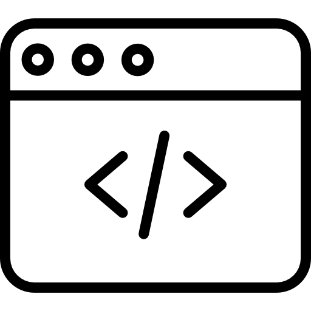
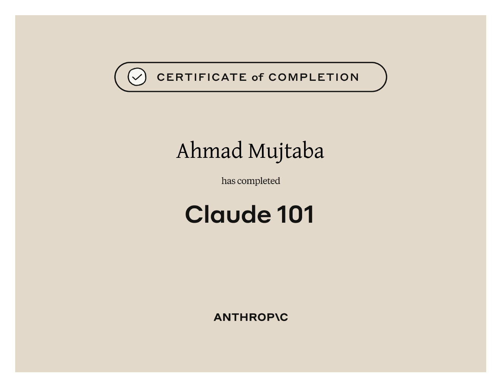
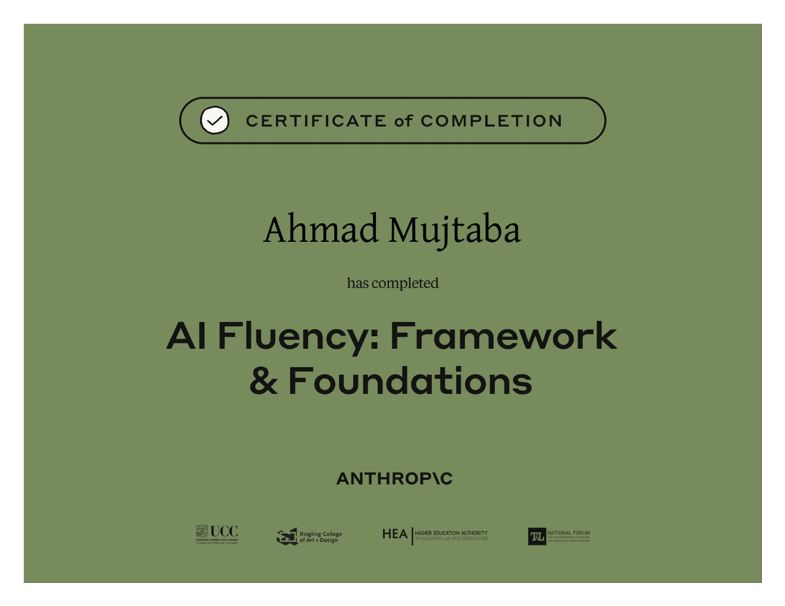
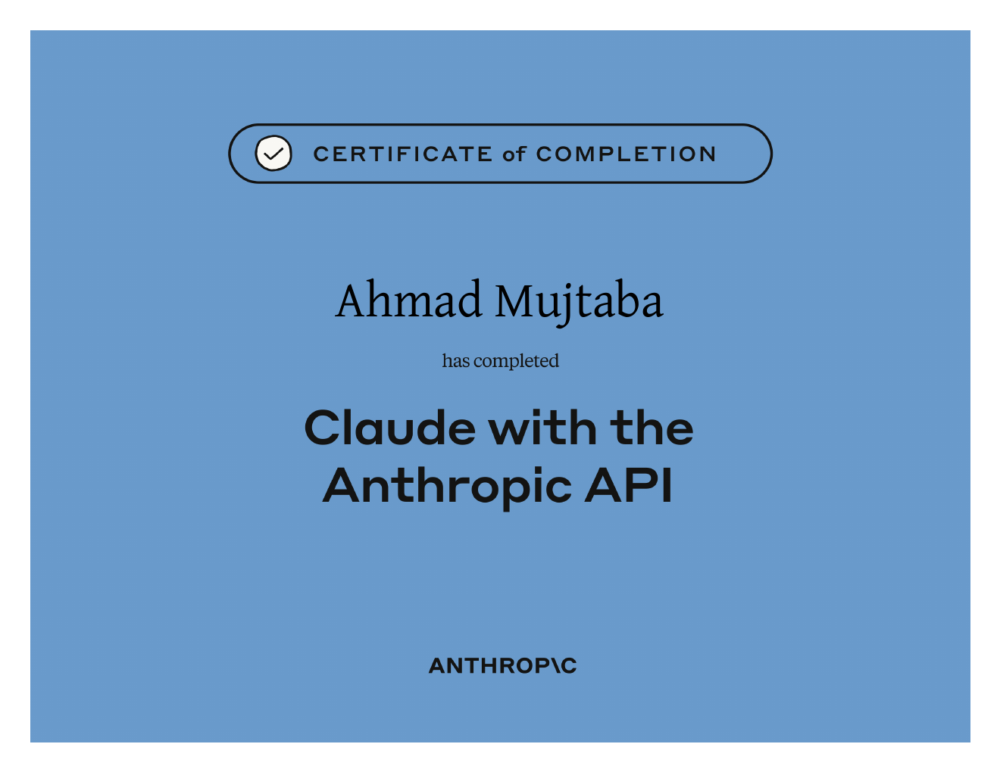
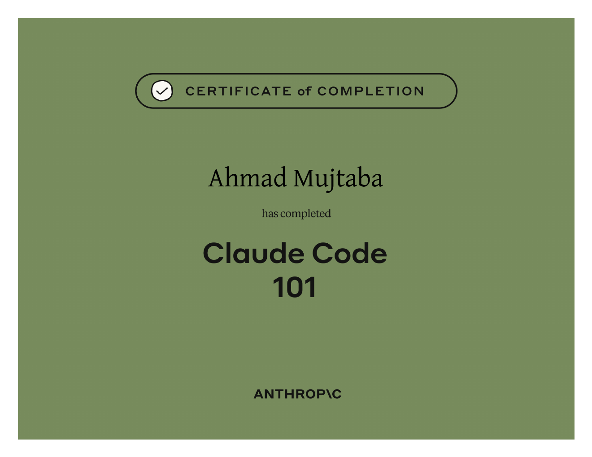

  <h1>Ahmad Mujtaba</h1>
  <h3>AI Engineer | Data Scientist | GenAI • Agentic AI • ML • LLMs | @Deloitte USI</h3>
  
<b>I build reliable Document AI, RAG, and agentic systems with evaluation and production safeguards built in.</b>

  
Structured Extraction · Retrieval Quality · Healthcare AI · Azure

  

    &nbsp;
    &nbsp;
    &nbsp;
    &nbsp;
    &nbsp;
    &nbsp;
    &nbsp;
    
     
    
  

  

    
    
  

  <a href="#selected-outcomes">Outcomes</a> ·
  <a href="#featured-work">Featured</a> ·
  <a href="#currently-building">Building</a> ·
  <a href="#engineering-principles">Principles</a> ·
  <a href="#writing">Writing</a> ·
  <a href="#certifications">Certifications</a> ·
  <a href="#github-statistics">Statistics</a> ·
  <a href="#repository">Repository</a> ·
  <a href="#contact--availability">Contact</a>

## About

I’m an Applied AI Engineer at Deloitte, where I build and evaluate production Document AI, retrieval, and agentic systems on Azure. My work focuses on structured extraction, retrieval quality, and deterministic safeguards. I also lead multi-agent fraud and compliance analytics work that combines risk scoring, human review, and governance guardrails. Before Deloitte, I worked at Cognizant on machine learning, conversational AI, warranty analytics, and production data pipelines.

## Selected Outcomes

The following team and system results come from internal employer evaluations. Client names, source data, task definitions, schemas, and proprietary code are omitted.

- **Browser task completion.** Task completion rose from **38% to 80%** in the same **200-task internal evaluation**. I worked on Milvus retrieval, reranking, and failure-aware routing. [Sanitized case study](docs/sanitized-outcomes.md#browser-task-completion) · Related public implementations: [computer-use loop](https://github.com/pypi-ahmad/cua-workbench) and [corrective retrieval](https://github.com/pypi-ahmad/agentic-rag-arxiv-research-assistant).
- **Browser-agent prompt tokens.** Prompt-token consumption dropped by **approximately 40%** in an internal evaluation that used raw DOM observations as its baseline. I worked on accessibility-tree snapshots and compressed observations. The evaluation size and trace details are confidential. [Sanitized case study](docs/sanitized-outcomes.md#browser-agent-prompt-tokens) · [Related public implementation](https://github.com/pypi-ahmad/cua-workbench).
- **Structured extraction.** Baseline accuracy was **80% to 81%** and rose above **90%** on the same internal benchmark. I worked on multi-pass extraction, confidence-aware retries, and routing. The corpus size, schemas, and scoring details are confidential. [Sanitized case study](docs/sanitized-outcomes.md#structured-extraction) · [Related public implementation](https://github.com/pypi-ahmad/grounded-docparse).
- **Policy-entity extraction.** Accuracy rose from **90% to 99%** on the same internal benchmark. I worked on prompt iteration, canonical comparison, and evaluation. The dataset size, policy documents, and entity schema are confidential. [Sanitized case study](docs/sanitized-outcomes.md#policy-entity-extraction) · [Related public implementation](https://github.com/pypi-ahmad/medical-document-intelligence-assistant).

## Featured Work

Selected public systems with production-focused engineering and supporting evidence.

### Grounded Document Parser

Grounded Document Parser handles native documents, scans, and mixed PDFs through native parsing or local OCR while retaining provenance. Extracted values link to source anchors, and the system rejects values without exact evidence. Its test suite covers 39 modules for parsing, routing, extraction, recovery, persistence, CLI, and UI behavior.

[Code](https://github.com/pypi-ahmad/grounded-docparse/tree/native-document-ingestion) · [Screenshot](https://github.com/pypi-ahmad/grounded-docparse/blob/native-document-ingestion/docs/images/document-parse-studio-full.png) · [Setup](https://github.com/pypi-ahmad/grounded-docparse/blob/native-document-ingestion/README.md#install-and-set-up) · [Architecture](https://github.com/pypi-ahmad/grounded-docparse/blob/native-document-ingestion/docs/architecture.md) · [Tests](https://github.com/pypi-ahmad/grounded-docparse/tree/native-document-ingestion/tests)

### LoRA Fine-tune Studio

LoRA Fine-tune Studio supports local adapter training on Windows and Linux. It validates datasets, checks CUDA and VRAM, uses isolated workers, recovers checkpoints, and compares adapters with base models. It supports five training approaches and four adapter methods. CI runs formatting, linting, type checks, and tests.

[Code](https://github.com/pypi-ahmad/lora-qlora-fine-tuning-app) · [Screenshot](https://github.com/pypi-ahmad/lora-qlora-fine-tuning-app/blob/main/docs/images/training-studio.png) · [Setup](https://github.com/pypi-ahmad/lora-qlora-fine-tuning-app#install-from-github) · [Architecture](https://github.com/pypi-ahmad/lora-qlora-fine-tuning-app/blob/main/TECHNICAL.md) · [Tests](https://github.com/pypi-ahmad/lora-qlora-fine-tuning-app/tree/main/tests)

### Computer Use Workbench

Computer Use Workbench provides consistent OpenAI, Anthropic, and Google computer-use routes in a sandboxed Ubuntu/XFCE desktop. It has three direct provider routes, expires credentials after eight hours, and retains audit frames for seven days or 1 GiB. CI checks backend and frontend tests, dependency audits, sandbox builds, and high/critical image scanning.

[Code](https://github.com/pypi-ahmad/computer-use) · [Screenshot](https://github.com/pypi-ahmad/computer-use/blob/main/assets/screenshot.png) · [Setup](https://github.com/pypi-ahmad/computer-use#quick-start) · [Architecture](https://github.com/pypi-ahmad/computer-use/blob/main/TECHNICAL.md) · [Tests](https://github.com/pypi-ahmad/computer-use/tree/main/tests)

### Local AI Chat Studio

Local AI Chat Studio supports streaming chat, comparison, replay, and response diffs for local and hosted models. It runs Ollama locally and supports optional provider and compatible gateway routes. It uses token budgets, provenance receipts, prompt-injection quarantine, and CI-verified provider and API contracts.

[Code](https://github.com/pypi-ahmad/local-ai-chat-studio) · [Screenshot](https://github.com/pypi-ahmad/local-ai-chat-studio/blob/main/docs/screenshot-chat.png) · [Setup](https://github.com/pypi-ahmad/local-ai-chat-studio#install-and-run) · [Architecture](https://github.com/pypi-ahmad/local-ai-chat-studio/blob/main/TECHNICAL.md) · [Tests](https://github.com/pypi-ahmad/local-ai-chat-studio/tree/main/tests)

## Repository Showcase

  <a href="https://github.com/pypi-ahmad/computer-use">
    <picture>
      <source media="(prefers-color-scheme: dark)" srcset="https://raw.githubusercontent.com/pypi-ahmad/pypi-ahmad/cards/cards/computer-use.dark.svg" />
      <source media="(prefers-color-scheme: light)" srcset="https://raw.githubusercontent.com/pypi-ahmad/pypi-ahmad/cards/cards/computer-use.light.svg" />
      
    </picture>
  </a>
  <a href="https://github.com/pypi-ahmad/grounded-docparse">
    <picture>
      <source media="(prefers-color-scheme: dark)" srcset="https://raw.githubusercontent.com/pypi-ahmad/pypi-ahmad/cards/cards/grounded-docparse.dark.svg" />
      <source media="(prefers-color-scheme: light)" srcset="https://raw.githubusercontent.com/pypi-ahmad/pypi-ahmad/cards/cards/grounded-docparse.light.svg" />
      
    </picture>
  </a>
  <a href="https://github.com/pypi-ahmad/Agentic-Document-Extraction">
    <picture>
      <source media="(prefers-color-scheme: dark)" srcset="https://raw.githubusercontent.com/pypi-ahmad/pypi-ahmad/cards/cards/Agentic-Document-Extraction.dark.svg" />
      <source media="(prefers-color-scheme: light)" srcset="https://raw.githubusercontent.com/pypi-ahmad/pypi-ahmad/cards/cards/Agentic-Document-Extraction.light.svg" />
      
    </picture>
  </a>
  <a href="https://github.com/pypi-ahmad/local-ai-chat-studio">
    <picture>
      <source media="(prefers-color-scheme: dark)" srcset="https://raw.githubusercontent.com/pypi-ahmad/pypi-ahmad/cards/cards/local-ai-chat-studio.dark.svg" />
      <source media="(prefers-color-scheme: light)" srcset="https://raw.githubusercontent.com/pypi-ahmad/pypi-ahmad/cards/cards/local-ai-chat-studio.light.svg" />
      
    </picture>
  </a>

## Currently Building

**[LoRA Fine-tune Studio](https://github.com/pypi-ahmad/lora-qlora-fine-tuning-app):** a local application for LoRA, QLoRA, OFT, and QOFT training workflows.

**Current question.** How can a local studio choose safe training defaults from GPU VRAM, dataset shape, and evaluation evidence while preserving reproducible runs?

## Engineering Principles

- **Evaluation first.** Define baselines, metrics, failure sets, and acceptance thresholds before changing a model or prompt.
- **Typed boundaries.** Validate LLM, tool, and API payloads before they change application state.
- **Observability.** Record traces, token use, retries, routing decisions, and failure reasons.
- **Security.** Scope credentials, validate inputs, isolate tool execution, and define retention limits.

## Writing

- **[Extraction Quality Research](https://github.com/pypi-ahmad/grounded-docparse/blob/native-document-ingestion/docs/extraction-quality-research.md).** An analysis of reference quality, regression metrics, OCR failure modes, and evidence limits.
- **[Computer Use: Zero-to-Hero Study Handbook](https://github.com/pypi-ahmad/computer-use/blob/main/docs/zero-to-hero-study-handbook.md).** A first-principles guide to computer-use agents, typed APIs, route fallback, and audited execution.
- **[Legal GraphRAG Architecture](https://github.com/pypi-ahmad/legal-graphrag/blob/main/docs/ARCHITECTURE.md).** An implementation note covering ingestion, hybrid retrieval, graph construction, and evaluation.

## Certifications

<b>Anthropic Education certificates (4)</b>

 

Selected Anthropic Education course certificates. Select a certificate to open the source PDF.

  
  
   
  
  

## Stack

<b>Technology stack</b>

 

- **Document AI and retrieval:** Azure Content Understanding, Docling, layout-aware parsing, OCR, multimodal document understanding, Milvus, FAISS, ChromaDB, hybrid search, reranking, and retrieval evaluation
- **LLM and agent systems:** Azure OpenAI, Azure AI Foundry, OpenAI, Anthropic, Gemini, Ollama, LangChain, LangGraph, MCP, structured outputs, tool calling, human-in-the-loop review, and PII-redaction guardrails
- **ML and fine-tuning:** PyTorch, Transformers, Hugging Face, LoRA/QLoRA, TRL, PEFT, vLLM, model evaluation, monitoring, deterministic risk scoring, Precision@K, and PR-AUC
- **Platform and delivery:** Python, SQL, FastAPI, Streamlit, React, Docker, Azure, AWS, PostgreSQL, SQLite, CI/CD, pytest, Vitest, Ruff, mypy/ty, tracing, and failure analysis
- **Healthcare and consulting delivery:** U.S. payer workflows, clinical-document processing, HIPAA/PHI handling, FHIR/HL7, SME workflow mapping, solution and compliance documentation, and client communication

## GitHub Statistics

  
  
   
  

<b>Advanced GitHub dashboard</b>

 

<picture>
  <source media="(prefers-color-scheme: dark)" srcset="https://raw.githubusercontent.com/pypi-ahmad/pypi-ahmad/main/profile-stats/reach.dark.svg" />
  <source media="(prefers-color-scheme: light)" srcset="https://raw.githubusercontent.com/pypi-ahmad/pypi-ahmad/main/profile-stats/reach.light.svg" />
  
</picture>

<picture>
  <source media="(prefers-color-scheme: dark)" srcset="https://raw.githubusercontent.com/pypi-ahmad/pypi-ahmad/main/profile-stats/coding.dark.svg" />
  <source media="(prefers-color-scheme: light)" srcset="https://raw.githubusercontent.com/pypi-ahmad/pypi-ahmad/main/profile-stats/coding.light.svg" />
  
</picture>

<picture>
  <source media="(prefers-color-scheme: dark)" srcset="https://raw.githubusercontent.com/pypi-ahmad/pypi-ahmad/main/profile-stats/distribution.dark.svg" />
  <source media="(prefers-color-scheme: light)" srcset="https://raw.githubusercontent.com/pypi-ahmad/pypi-ahmad/main/profile-stats/distribution.light.svg" />
  
</picture>

## Activity

<picture>
  <source media="(prefers-color-scheme: dark)" srcset="https://github-readme-activity-graph.vercel.app/graph?username=pypi-ahmad&amp;theme=github-dark&amp;area=true&amp;hide_border=true&amp;days=31&amp;custom_title=GitHub%20Activity" />
  <source media="(prefers-color-scheme: light)" srcset="https://github-readme-activity-graph.vercel.app/graph?username=pypi-ahmad&amp;theme=github-light&amp;area=true&amp;hide_border=true&amp;days=31&amp;custom_title=GitHub%20Activity" />
  
</picture>

<b>Contribution arcade</b>

 

  <picture>
    <source media="(prefers-color-scheme: dark)" srcset="https://raw.githubusercontent.com/pypi-ahmad/pypi-ahmad/output/github-contribution-grid-snake-dark.svg" />
    <source media="(prefers-color-scheme: light)" srcset="https://raw.githubusercontent.com/pypi-ahmad/pypi-ahmad/output/github-contribution-grid-snake.svg" />
    
  </picture>

  <picture>
    <source media="(prefers-color-scheme: dark)" srcset="https://raw.githubusercontent.com/pypi-ahmad/pypi-ahmad/output/pacman-contribution-graph-dark.svg" />
    <source media="(prefers-color-scheme: light)" srcset="https://raw.githubusercontent.com/pypi-ahmad/pypi-ahmad/output/pacman-contribution-graph.svg" />
    
  </picture>

  <picture>
    <source media="(prefers-color-scheme: dark)" srcset="https://raw.githubusercontent.com/pypi-ahmad/pypi-ahmad/output/breakout-contribution-graph-dark.svg" />
    <source media="(prefers-color-scheme: light)" srcset="https://raw.githubusercontent.com/pypi-ahmad/pypi-ahmad/output/breakout-contribution-graph.svg" />
    
  </picture>

  <picture>
    <source media="(prefers-color-scheme: dark)" srcset="https://raw.githubusercontent.com/pypi-ahmad/pypi-ahmad/output/galaga-contribution-graph-dark.svg" />
    <source media="(prefers-color-scheme: light)" srcset="https://raw.githubusercontent.com/pypi-ahmad/pypi-ahmad/output/galaga-contribution-graph.svg" />
    
  </picture>

  <picture>
    <source media="(prefers-color-scheme: dark)" srcset="https://raw.githubusercontent.com/pypi-ahmad/pypi-ahmad/output/bomberman-contribution-graph-dark.svg" />
    <source media="(prefers-color-scheme: light)" srcset="https://raw.githubusercontent.com/pypi-ahmad/pypi-ahmad/output/bomberman-contribution-graph.svg" />
    
  </picture>

  <picture>
    <source media="(prefers-color-scheme: dark)" srcset="https://raw.githubusercontent.com/pypi-ahmad/pypi-ahmad/output/puzzle-bobble-contribution-graph-dark.svg" />
    <source media="(prefers-color-scheme: light)" srcset="https://raw.githubusercontent.com/pypi-ahmad/pypi-ahmad/output/puzzle-bobble-contribution-graph.svg" />
    
  </picture>

  <picture>
    <source media="(prefers-color-scheme: dark)" srcset="https://raw.githubusercontent.com/pypi-ahmad/pypi-ahmad/output/minesweeper-contribution-graph-dark.svg" />
    <source media="(prefers-color-scheme: light)" srcset="https://raw.githubusercontent.com/pypi-ahmad/pypi-ahmad/output/minesweeper-contribution-graph.svg" />
    
  </picture>

<b>Contribution history</b>

 

  <picture>
    <source media="(prefers-color-scheme: dark)" srcset="https://raw.githubusercontent.com/pypi-ahmad/pypi-ahmad/main/profile-3d-contrib/profile-night-rainbow.svg" />
    <source media="(prefers-color-scheme: light)" srcset="https://raw.githubusercontent.com/pypi-ahmad/pypi-ahmad/main/profile-3d-contrib/profile-green.svg" />
    
  </picture>

## Repository

The [`main`](https://github.com/pypi-ahmad/pypi-ahmad) branch is the source of record. See the [changelog](CHANGELOG.md).

- Profile and outcomes: `README.md`, [`docs/sanitized-outcomes.md`](docs/sanitized-outcomes.md), [`DATASET.md`](DATASET.md)
- Governance: [`CONTRIBUTING.md`](CONTRIBUTING.md), [`SECURITY.md`](SECURITY.md), [`CODE_OF_CONDUCT.md`](CODE_OF_CONDUCT.md)

## Contact & Availability

I’m open to selective remote-first Applied AI and GenAI engineering roles, with a focus on Document AI, RAG, evaluation, and computer-use systems.

I’m based in **Gurugram, India** (IST, UTC+05:30).

  
<b>AI Engineer | Data Scientist | GenAI • Agentic AI • ML • LLMs | @Deloitte USI</b>

  

    &nbsp;
    &nbsp;
    &nbsp;
    &nbsp;
    &nbsp;
    &nbsp;
    &nbsp;
    
  

[Email](mailto:ahmad.iiitk@gmail.com) · [X / Twitter](https://x.com/pypi_ahmad) · [LinkedIn](https://www.linkedin.com/in/ahmad-mle/) · [GitHub](https://github.com/pypi-ahmad) · [Portfolio](https://pypi-ahmad.github.io/) · [WhatsApp](https://wa.me/pypi_ahmad) · [Telegram](https://t.me/dataintuitionist) · [Instagram](https://www.instagram.com/dataintuitionist/) · [Facebook](https://www.facebook.com/dataintuitionist/)

  

Made with ❤️ by Ahmad Mujtaba

