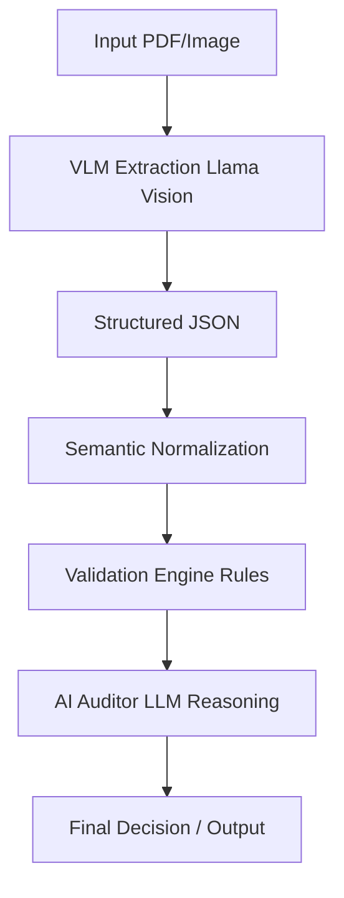
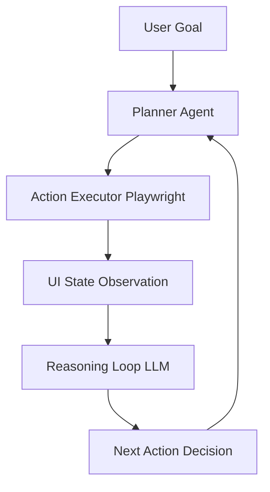
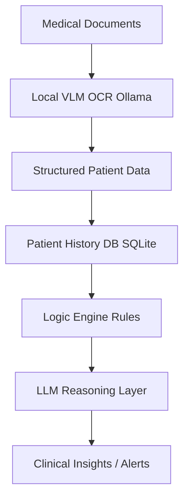

<!-- ======================= HEADER ======================= -->

  

  <h2>Hi, I'm Ahmad 👋</h2>

  
    

  

    
    
    
  

 

<!-- ======================= SUMMARY ======================= -->
## 🚀 What I Do

I focus on the **hardest problem in GenAI today**: turning LLMs into **reliable, production-grade systems**.

- Designing **System-2 AI architectures** (plan → reflect → verify → execute)
- Building **agentic workflows with tool use + memory**
- Solving **last-mile reliability, evals, and observability**
- Moving from **"demo intelligence" → "production intelligence"**

---

<!-- ======================= PROJECTS ======================= -->
## 🔥 Flagship Systems

### 🧠 Autonomous Research Agent (System-2 AI)

  
  
  

Autonomous multi-agent system for deep research and report generation

- LangGraph-based plan-and-execute architecture
- Iterative web scraping + grounded summarization
- Context management to prevent token overflow
- Final synthesis into structured reports

**Why it’s strong**
- Moves beyond RAG → true reasoning system
- Mimics human research loops

**Impact**
- 3–5× faster research workflows
- Strong hallucination reduction via grounding

---

### 🤖 Computer-Using Agent (CUA)

  
  
  

Agents that operate real-world UIs using reasoning + vision

- Playwright + MCP tool abstraction
- SOP injection via vector DB (Milvus)
- Vision-guided UI navigation

**Why it’s strong**
- Real-world execution → not sandbox agents
- Foundation for enterprise automation systems

**Impact**
- ~80% success rate in semi-structured UI tasks
- Replaces manual operational workflows

👉 **[Read Case Study Below](#-case-study-2--computer-using-agent-cua)**

---

### 📄 Intelligent Document Processing (IDP AI)

  
  
  

VLM-powered pipeline for invoice and document intelligence

- Llama Vision for single-pass structured extraction
- Semantic vendor normalization (fuzzy + vector)
- Hybrid validation: deterministic + LLM reasoning

**Why it’s strong**
- Combines rules + reasoning (rare and powerful)
- Handles real-world noisy documents

**Impact**
- ~99% extraction accuracy
- Fraud detection via AI auditing

👉 **[Read Case Study Below](#-case-study-1--intelligent-document-processing-idp-ai)**

---

### 🎥 Multimodal Video RAG System

  
  
  

Semantic search across video frames using text and image queries

- Frame-level embedding pipeline
- Cross-modal retrieval (text ↔ image)
- GPU-aware dynamic batching

**Why it’s strong**
- Eliminates manual tagging
- Enables natural language video search

**Impact**
- Massive reduction in video analysis time
- Works on raw, unstructured footage

---

### 🧠 Self-Healing Text-to-SQL Agent

  
  
  

Agent that converts natural language into safe, executable SQL

- Dynamic schema injection
- SQL guardrails (destructive query blocking)
- Retry loop with error-aware correction

**Why it’s strong**
- Not just generation → self-healing system
- Separation of concerns (writer / guardian / executor)

**Impact**
- Enables non-technical users to query databases
- Prevents destructive operations

---

## 🧠 Other Notable Systems

- **Clinical Decision Support System** (HIPAA-ready local VLM pipeline) 👉 **[Case Study](#-case-study-3--clinical-decision-support-system-mediscan)**
- **Digital Second Brain** (multimodal RAG + knowledge graph)
- **Nexus Agent** (task + memory orchestration system)
- **Traffic Violation Detection** (real-time CV + tracking)
- **Face Recognition System** (vector DB identity matching)
- **AutoML Pipelines** (FLAML-based production ML systems)

---

<!-- ======================= TECH STACK ======================= -->
<h2 align="center">🛠️ Technical Arsenal</h2>

<table align="center" width="100%">
  <tr>
    <td align="center" width="20%"><b>🤖 Generative AI</b></td>
    <td align="center" width="20%"><b>🧠 Machine Learning</b></td>
    <td align="center" width="20%"><b>🌩️ Cloud & DevOps</b></td>
    <td align="center" width="20%"><b>📊 Data Engineering</b></td>
    <td align="center" width="20%"><b>💻 Core & Web</b></td>
  </tr>
  <tr>
    <td align="center" valign="top">
      
       
       
       
       
      
    </td>
    <td align="center" valign="top">
       
       
       
       
      
    </td>
    <td align="center" valign="top">
       
       
       
       
      
    </td>
    <td align="center" valign="top">
       
       
       
       
       
      
    </td>
    <td align="center" valign="top">
       
       
       
       
      
    </td>
  </tr>
</table>

 

<!-- ======================= STATS ======================= -->
<h2 align="center">⚡ Activity</h2>

  
  

 

<!-- ======================= PHILOSOPHY ======================= -->
<h2 align="center">🧠 Engineering Philosophy</h2>

  

  I treat LLMs as <b>unreliable components</b> and build systems that enforce  
  <b>verification, observability, and deterministic behavior</b>.

 

<!-- ======================= SNAKE ======================= -->

  

 

<!-- ======================= CASE STUDIES ======================= -->
# 📚 Deep Dive Case Studies

## 🧠 CASE STUDY 1 — Intelligent Document Processing (IDP AI)

### 📌 Problem
Traditional invoice/document pipelines rely on:
- **OCR + regex** → brittle and error-prone
- **Template-based extraction** → fails on real-world variation

**Goal:** Build a system that can handle noisy, unstructured, real-world financial documents with high accuracy + fraud awareness.

### 🏗️ System Architecture

### ⚙️ Key Components

#### 1. Generative OCR (VLM-based)
- **Replaces:** OCR → parsing → mapping
- **With:** Single-pass structured extraction
- **Why it matters:** Removes 3 failure points & handles layout variance naturally.

#### 2. Semantic Entity Resolution
- **Vendor names:** Fuzzy + vector matching
- **Design choice:** Avoid strict string matching (too fragile) → use semantic similarity.

#### 3. Hybrid Validation Layer
| Type | Role |
| :--- | :--- |
| **Deterministic** | Required fields, thresholds |
| **Probabilistic (LLM)** | Fraud signals, anomalies |

> **Key Idea:** Combine rules (precision) + LLM (reasoning).

#### 4. AI Auditor (Forensic Layer)
- Detects suspicious vendor emails, inconsistent tax logic, and unusual patterns.
- **Result:** Beyond extraction → decision intelligence.

### 🚀 Key Innovations
- Single-pass VLM extraction (no OCR pipeline fragmentation)
- Hybrid guardrails (rules + reasoning)
- Semantic normalization instead of string matching

### ⚖️ Tradeoffs
| Decision | Tradeoff |
| :--- | :--- |
| **VLM over OCR** | Higher cost per request |
| **LLM auditing** | Non-deterministic outputs |
| **Fuzzy matching** | Potential false positives |

### 📊 Impact
- **~99% structured extraction accuracy**
- Near zero manual intervention
- Detects fraud patterns missed by rule-based systems

> **Takeaway:** This system transforms IDP from “data extraction” → decision intelligence pipeline.

---

## 🤖 CASE STUDY 2 — Computer-Using Agent (CUA)

### 📌 Problem
Most automation systems:
- Break on UI changes
- Require hardcoded selectors
- Cannot reason about tasks

**Goal:** Build an agent that can understand UI state, execute tasks dynamically, and adapt like a human operator.

### 🏗️ System Architecture

### ⚙️ Key Components

#### 1. MCP Tool Layer
- Abstracts UI actions: `click`, `type`, `navigate`.
- **Note:** LLM doesn’t control browser directly; it uses structured tools.

#### 2. SOP Injection (Milvus)
- **Stores:** Prior workflows & execution patterns.
- **Why it matters:** Adds memory + consistency, reduces exploration cost.

#### 3. Vision-Guided Interaction
- Uses UI context instead of brittle selectors.
- **Moves from:** “click #btn-123” → **To:** “click submit button near form”.

#### 4. Feedback Loop
`Action → Observe → Evaluate → Retry`
- Enables adaptive execution & handles partial failures.

### 🚀 Key Innovations
- Tool-based abstraction (MCP)
- UI reasoning instead of hardcoded automation
- Memory-driven execution (SOP retrieval)

### ⚖️ Tradeoffs
| Decision | Tradeoff |
| :--- | :--- |
| **LLM control loop** | Latency |
| **Vision grounding** | Higher compute |
| **SOP memory** | Maintenance overhead |

### 📊 Impact
- **~80% reliability** in semi-structured UIs
- Automates workflows previously requiring humans
- Foundation for enterprise agent automation

> **Takeaway:** This system moves automation from scripts → intelligent agents.

---

## 🏥 CASE STUDY 3 — Clinical Decision Support System (MediScan)

### 📌 Problem
Healthcare systems struggle with:
- Manual data entry from PDFs/faxes
- Fragmented patient records
- High risk of prescription or claim errors

**Goal:** Build a privacy-first AI system that processes medical documents locally, extracts structured data, and assists in clinical + insurance decisions.

### 🏗️ System Architecture

### ⚙️ Key Components

#### 1. Local-First OCR (Privacy Layer)
- Runs fully offline using **Ollama** / **DeepSeek**.
- **Result:** No PHI leaves system (Critical for HIPAA compliance).

#### 2. Longitudinal Patient Analysis
- Cross-references medications, diagnoses, and history.
- **Result:** Enables context-aware decisions.

#### 3. BYOK LLM Adapter
- Local model → fallback to cloud.
- **Why it matters:** Balances privacy, performance, and cost.

#### 4. Insurance + Clinical Logic Engine
- Validates prescriptions, eligibility, and risk signals.

### 🚀 Key Innovations
- **Air-gapped AI pipeline** (rare)
- Hybrid local + cloud inference strategy
- Combines medical + insurance reasoning

### ⚖️ Tradeoffs
| Decision | Tradeoff |
| :--- | :--- |
| **Local models** | Lower accuracy vs cloud |
| **SQLite** | Limited scalability |
| **Rule-based checks** | Maintenance overhead |

### 📊 Impact
- Eliminates manual medical data entry
- Reduces prescription + claim errors
- Enables privacy-compliant AI deployment

> **Takeaway:** This system shows how AI can be deployed in regulated environments without compromising privacy.

 

<!-- ======================= FOOTER ======================= -->

  

